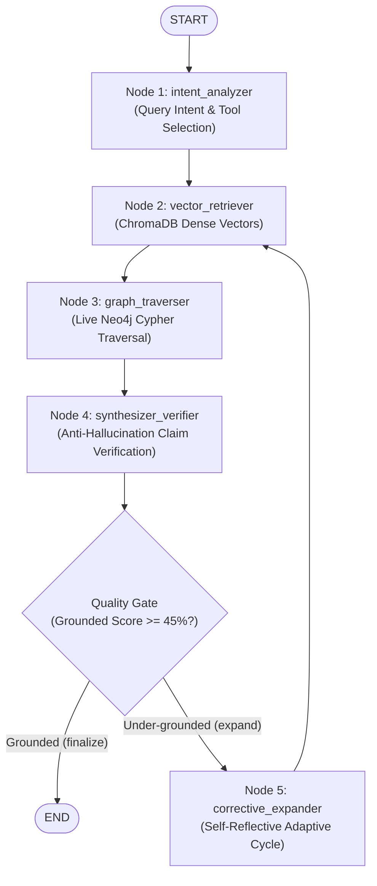

# RAISE Academic GraphRAG Pipeline Architecture

## 1. Pipeline Overview

The RAISE pipeline operates in two decoupled phases:
1. **Ingestion Time (Offline Indexing)**: Converts raw PDF reports into context-enriched chunks, dense vectors in ChromaDB, and property graph subgraphs in Neo4j.
2. **Query Time (LangGraph StateGraph Execution)**: Executes multi-hop retrieval across vector embeddings and property graph relationships to synthesize grounded answers with deep-linked page citations.

---

## 2. Ingestion Flow (PDF ➔ ChromaDB & Neo4j)

```text
PDF Document in data/documents/
  │
  ▼ [PyMuPDF (fitz)]
Page-Aware Digital Text & Table Extraction
  │
  ▼ [Context Anchor Enrichment]
Prepends: Institution, Document, Period, Page Number, Heading Path
  │
  ├──► [SentenceTransformers: all-MiniLM-L6-v2] ──► ChromaDB (Cosine HNSW Index)
  │
  └──► [Academic Domain Extractor] ──► Entities & Triples ──► Neo4j (bolt://localhost:7687)
```

---

## 3. Query Flow (LangGraph `StateGraph`)

Every user research query flows through a compiled 5-node cyclical `StateGraph`:



### StateGraph Nodes:
1. **`intent_analyzer`**: Classifies query into `COMPARATIVE_SYNTHESIS`, `DIRECT_METRIC`, `ORGANIZATION_DEEPDIVE`, `CLAIM_VERIFICATION`, or `SIMPLE_FACT`.
2. **`vector_retriever`**: Performs cosine search on ChromaDB, returning top-$k$ chunks with exact page numbers.
3. **`graph_traverser`**: Queries Neo4j using native Cypher pattern matching (`MATCH (seed)-[r*1..2]-(m)`) scoped to the selected document or global vault.
4. **`synthesizer_verifier`**: Synthesizes response, verifies numerical assertions against retrieved chunks, and anchors citation tags `[1]`, `[2]`.
5. **`corrective_expander`**: Cyclically expands search radius ($top\_k + 3$, $hops + 1$) if grounding confidence is below threshold.

---

## 4. Citation & Evidence Traceability
* **In-text citations**: `[1]`, `[2]` link directly to the **Evidence Drawer**.
* **Page Anchors**: Clicking **Page 14** deep-links directly into the PDF viewer (`/api/pdf/Report.pdf#page=14`).
* **Evidence Count Rules**:
  * Distinct cited PDFs = **Source Documents**
  * Retrieved text snippets = **Evidence Passages**
  * Bracketed tokens = **Citations**
