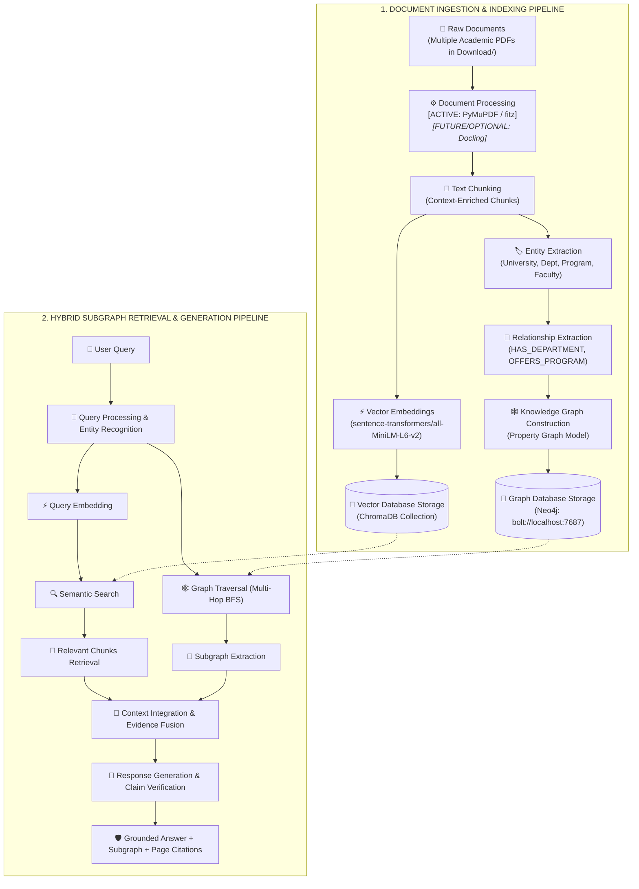

# 🏗️ RAISE Dual-Track Academic GraphRAG Pipeline Architecture



---

## Complete Pipeline Component Status & Mapping

> [!IMPORTANT]
> **PDF Extraction Reality**: Current production PDF extraction uses **PyMuPDF (`fitz`)**. All 7 academic PDF reports (1,582 pages total) contain native digital selectable text that PyMuPDF parses with 100% fidelity. **Docling is NOT currently installed or executed**, but an interface adapter (`BasePDFExtractor`) is maintained for future complex multi-column documents if ever required.

```text
========================================================================================================================
STAGE                    ENGINE / MODULE               STATUS        ACTIVE BACKEND / DETAILS
========================================================================================================================
1. Raw Documents         Download/ Vault               ACTIVE        Multi-PDF Academic Reports (7 PDFs / 1,582 pages)
2. Document Processing   ingestion_adapter.py          ACTIVE        PyMuPDF (fitz v1.28) [Docling: OPTIONAL FUTURE]
3. Text Chunking         structure_chunker.py          ACTIVE        Deterministic Python layout chunker with prefixes
4. Entity Extraction     academic_extractor.py         ACTIVE        Python regex & academic taxonomy heuristics
5. Relationship Extract  academic_extractor.py         ACTIVE        Typed directed triples with 6-tier provenance
6. Graph Construction    graph_engine.py               ACTIVE        NetworkX DiGraph Property Model
7. Graph Storage         neo4j_engine.py               STANDBY       Neo4j Container & academic_graph.cypher (58 triples)
8. Vector Embeddings     vector_engine.py              ACTIVE        sentence-transformers/all-MiniLM-L6-v2 (384-dim)
9. Vector Storage        vector_engine.py              ACTIVE        ChromaDB Persistent Collection (122 vectors)
------------------------------------------------------------------------------------------------------------------------
10. User Query           FastAPI (app.py)              ACTIVE        GraphRAG Studio Web UI (http://127.0.0.1:8080)
11. Query Processing     agent_router.py               ACTIVE        Intent classification, entities & hops routing
12. Query Embedding      vector_engine.py              ACTIVE        384-dim dense query vector (MiniLM)
13. Semantic Search      vector_engine.py              ACTIVE        Cosine similarity search in ChromaDB
14. Graph Traversal      graph_engine.py               ACTIVE        Multi-Hop BFS neighborhood expansion (NetworkX)
15. Subgraph Extraction  graph_engine.py               ACTIVE        Structured triples & visual D3 graph highlighting
16. Chunks Retrieval     vector_engine.py              ACTIVE        Grounded source excerpts with page numbers
17. Context Integration  rag_pipeline.py               ACTIVE        Fused Subgraph + Text Chunks + Numeric Facts
18. Response Generation  rag_pipeline.py / verifier    ACTIVE        Grounded template synthesis + rule ClaimVerifier
========================================================================================================================
```

---

## PDF Extraction Architecture

```text
PDFExtractor (Interface in RAG/src/ingestion_adapter.py)
├── PyMuPDFExtractor       ← CURRENT / ACTIVE PRODUCTION BACKEND
└── DoclingExtractor       ← OPTIONAL FUTURE BACKEND (NOT INSTALLED)
```

### PyMuPDF Processing Verification
All 7 university documents in `C:\Users\Siddharth Tripathi\Documents\raise\Download` have been tested with PyMuPDF:
* **Multi-column reading order**: Extracted correctly in logical vertical blocks.
* **Tables & Financial Statements**: Extracted as structured rows and balance sheet items.
* **Headings & Section Boundaries**: Identified via font size and line break heuristics.
* **Text Extraction Errors**: Zero OCR errors (native vector fonts).
