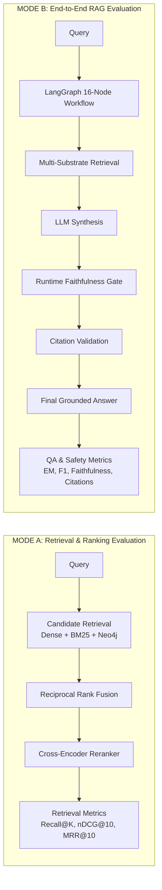

# RAISE Baseline Evaluation Plan

**Document Status**: AUTHORITATIVE PROTOCOL  
**Version**: 1.0.0  
**Target Architecture**: RAISE Academic GraphRAG Pipeline  
**Execution Environment**: Python 3.13 / Windows 11 / CUDA / PostgreSQL 16 / Redis 7 / Neo4j 5.26  
**Core Directive**: Establish an immutable, multi-tiered baseline across every layer of the system before any production changes.

---

## 1. Executive Plan & Strategic Objectives

The RAISE Baseline Evaluation Plan defines the complete methodology, dataset splits, metrics, ablation matrix, and protocol rules required to establish an auditable, reproducible baseline.

The evaluation addresses five critical questions:
1. **Retrieval Sufficiency**: Does the multi-substrate retriever (ChromaDB + BM25 + Neo4j) reliably find the necessary supporting evidence?
2. **Ranking & Fusion Integrity**: Does RRF and the BGE Cross-Encoder rank gold evidence in the top-$K$ context without dropping or suppressing critical facts?
3. **Graph Value Addition**: Does Neo4j graph traversal measurably increase final answer correctness compared to dense+sparse retrieval alone?
4. **Answer Faithfulness & Verification**: Does the LangGraph cyclical state machine and Runtime Faithfulness Quality Gate successfully prevent hallucinations and ungrounded claims without unnecessary refusals?
5. **Conversational Memory Viability**: Do PostgreSQL 16 long-term message logs and Redis 7 ephemeral state provide genuine multi-turn context retention without cross-session contamination?

---

## 2. Multi-Tier Benchmark Suite

### Tier 1 — RAISE Domain Benchmark (Primary Target Domain)

The domain-specific academic benchmark measures RAISE on its exact real-world target documents: multi-institutional annual reports, financial statements, research grant portfolios, and academic startup incubation.

- **Corpus**:
  1. `BRIC-Annual-Report-2025.pdf` (Biotechnology Research and Innovation Council, 218 pages, 1,397 entities)
  2. `Annual Report 2023-24.pdf` (National Institute of Plant Genome Research, 165 pages, 1,488 entities)
  3. `Annual Report 2022-23.pdf` (NIPGR, 160 pages, 1,428 entities)
  4. `Annual Report 2021-22.pdf` (NIPGR, 160 pages, 288 entities)
- **Question Sets**:
  - **Locked Institutional QA Suite** (`backend/evaluation/benchmark_qa.json`): 16 locked diagnostic questions across 4 distinct tiers:
    - *Tier 1: Exact Table Metrics* (e.g., Balance sheet line items, Capital funds, exact rupee figures, student counts, EIR program numbers).
    - *Tier 2: Multi-Hop Entity Relationships* (e.g., Director and co-signatory administrative roles, incubator-startup partnerships).
    - *Tier 3: Longitudinal Trend Analysis* (e.g., Multi-year funding comparisons across 2021-2024).
    - *Tier 4: Unanswerable Traps* (e.g., Underwater nuclear submarine research — tests safe abstention).
  - **Google FRAMES Benchmark** (`Artifacts/benchmarks/frames/` & `backend/evaluation/benchmarks/frames/data/`):
    - 824 official multi-hop reasoning questions (`test.tsv`, SHA-256: `1f5b0a29345eae1708761cb69c4b1254ac2ff2621f8a3a2cd85c072a113834b9`).
    - Evaluates multi-step numerical comparisons, multi-hop fact retrieval, temporal reasoning, and unanswerable condition detection.

---

### Tier 2 — Natural Questions (NQ Open-Domain Retrieval)

Measures single-hop open-domain retrieval efficiency and answer extraction.
- **Metrics**: Recall@1, Recall@5, Recall@10, Recall@20, Recall@100, MRR@10, nDCG@10, Exact Match (EM), Token F1.
- **Diagnostic Objective**: Detect fundamental bottlenecks in query understanding, embedding retrieval, lexical matching, and passage selection.

---

### Tier 3 — HotpotQA (Multi-Hop Evidence Composition)

Measures 2-hop retrieval, cross-document reasoning, and supporting-fact identification.
- **Metrics**: Answer EM, Answer F1, Supporting Fact Precision, Supporting Fact Recall, Supporting Fact F1, Joint EM/F1, Hop Completion Rate.
- **Diagnostic Objective**: For every question, trace:
  - Did RAISE retrieve supporting fact A?
  - Did RAISE retrieve supporting fact B?
  - Were both facts present in the LLM context?
  - Did the LLM synthesize the correct joint answer?

---

### Tier 4 — 2WikiMultihopQA (Explicit Relational Reasoning)

Measures structured multi-hop reasoning across entity graphs.
- **Metrics**: Entity Linking Success, Cypher Generation Success, Cypher Execution Success, Cypher Repair Success, Path Completeness, Graph-to-Context Transfer Rate, Answer EM/F1.
- **Diagnostic Objective**: Evaluate whether Neo4j property graph traversal and Cypher querying actually deliver actionable graph context to the LLM.

---

### Tier 5 — MuSiQue (High-Hop Stress Testing)

Measures complex multi-hop composition across 2-hop, 3-hop, and 4-hop questions, including contrast unanswerable questions.
- **Metrics**: Hop-stratified EM/F1 (2-hop, 3-hop, 4-hop), Complete Reasoning Chain Recall, Unsupported Answer Rate, Correct Abstention Rate.
- **Diagnostic Objective**: Determine whether RAISE fabricates answers when one hop in a 3-hop or 4-hop chain fails.

---

### Tier 6 — BEIR (Retrieval Generalization Suite)

Measures zero-shot retrieval generalization across heterogeneous corpora (e.g., SciFact, NFCorpus, FiQA).
- **Metrics**: nDCG@10, MAP@100, Recall@100, MRR@10.
- **Protocol**: Standard BEIR official qrels preserved without modification.

---

### Tier 7 — TREC-DL (Deep Learning Track Passage Ranking)

Measures precision ranking over graded relevance judgments.
- **Metrics**: nDCG@10, MAP, MRR.
- **Protocol**: Graded relevance labels strictly preserved. Mode A retrieval only (no LLM generation).

---

## 3. Two Distinct Evaluation Modes

Every benchmark execution must declare its evaluation mode:

- **Mode A (Retrieval Only)**: Measures candidate retrieval, RRF, and cross-encoder reranking. No LLM tokens consumed.
- **Mode B (End-to-End RAG)**: Measures the entire pipeline from query intake through LangGraph routing, synthesis, FineCat NLI verification, and citation validation.

Mode A and Mode B results must **never** be averaged into a single collapsed score.

---

## 4. Required Ablation Matrix (Configurations A–H)

To measure the marginal contribution of each architectural component, the baseline must execute across 8 distinct ablation configurations:

| Configuration ID | Name | Retr: Dense | Retr: BM25 | Retr: Neo4j | RRF Fusion | Cross-Encoder Reranker | LangGraph Agent | Quality Gate | Memory (PG+Redis) |
| :- | :- | :-: | :-: | :-: | :-: | :-: | :-: | :-: | :-: |
| **ABL-A** | BM25 Only | ❌ | ✅ | ❌ | ❌ | ❌ | ❌ | ❌ | ❌ |
| **ABL-B** | Dense Only | ✅ | ❌ | ❌ | ❌ | ❌ | ❌ | ❌ | ❌ |
| **ABL-C** | Dense + BM25 | ✅ | ✅ | ❌ | ✅ ($k=60$) | ❌ | ❌ | ❌ | ❌ |
| **ABL-D** | Dense + BM25 + Neo4j | ✅ | ✅ | ✅ | ✅ ($k=60$) | ❌ | ❌ | ❌ | ❌ |
| **ABL-E** | Full Retrieval | ✅ | ✅ | ✅ | ✅ | ✅ (BGE-Large) | ❌ | ❌ | ❌ |
| **ABL-F** | Full RAG | ✅ | ✅ | ✅ | ✅ | ✅ | ✅ (16 nodes) | ❌ | ❌ |
| **ABL-G** | Full Verified RAG | ✅ | ✅ | ✅ | ✅ | ✅ | ✅ | ✅ ($\ge 0.80$) | ❌ |
| **ABL-H** | Full RAG + Memory | ✅ | ✅ | ✅ | ✅ | ✅ | ✅ | ✅ | ✅ (Postgres+Redis)|

---

## 5. Component-Level Diagnostic Plans

### 5.1 Chunking Evaluation Plan
Evaluate the 8-stage GGAHC chunker against standard baselines:
- **Strategies**: `fixed_size` (512 tokens), `character_recursive`, `sliding_window` (256/64), `hierarchical_section`, `table_preserving`, `gga_hybrid`.
- **Metrics**: Evidence fragmentation rate, gold evidence recall@10, downstream QA F1, table cell preservation rate.

### 5.2 Embedding Evaluation Plan
- **Model**: `BAAI/bge-large-en-v1.5` (1024-dim, cosine, batch size 32).
- **Metrics**: Recall@5, Recall@10, Recall@100, MRR@10, latency per query (ms), GPU VRAM footprint.

### 5.3 BM25 Evaluation Plan
- **Index**: `SelfContainedBM25` with Okapi scoring.
- **Parameters**: $k_1 \in [1.2, 1.5, 1.8]$, $b \in [0.65, 0.75, 0.85]$.
- **Test Scenarios**: Exact table metric queries vs acronym/entity queries vs natural prose.

### 5.4 Neo4j Graph & Cypher Evaluation Plan
- **Key Metric**: 
  $$\text{Graph Answer Gain} = \text{Accuracy}_{\text{with\_graph}} - \text{Accuracy}_{\text{without\_graph}}$$
- **Graph Diagnostics**: Entity resolution rate, relationship traversal success, Cypher syntax validity, Cypher repair trigger frequency, graph fallback rate.

### 5.5 RRF & Reranker Evaluation Plan
- **RRF Parameters**: $k \in [20, 60, 100]$, table boost weights $[1.0, 1.15, 1.30]$.
- **Reranker**: `BAAI/bge-reranker-large` via `CrossEncoderModelSingleton`.
- **Diagnostics**: False promotion rate (irrelevant chunks promoted to top-4), false suppression rate (gold evidence demoted out of top-8), threshold over-pruning.

### 5.6 Memory & Session State Plan (PostgreSQL 16 + Redis 7)
- **Protocol**: 3-turn controlled dialogue:
  - Turn 1: Entity declaration (*"My target institution is National Institute of Plant Genome Research"*).
  - Turn 2: Unrelated distractor question (*"What is the formula for chlorophyll photosynthesis?"*).
  - Turn 3: Context recall probe (*"What was the total budget of the institution I specified earlier?"*).
- **Configurations**: Memory OFF vs Redis Only vs PostgreSQL Only vs Redis + PostgreSQL.
- **Metrics**: Memory read/write latency, coreference resolution accuracy, cross-session contamination (verifying run $N+1$ cannot read session memory from run $N$).

---

## 6. Immutable Storage & Run Provenance

Every evaluation run must:
1. Generate an immutable UUID `run_id` (e.g. `run_20260924_061500_baseline`).
2. Write full run metadata, environment manifest, and per-case results to **PostgreSQL 16** (`evaluation_runs`, `evaluation_cases`, `evaluation_retrieval_trace`, `evaluation_failures`).
3. Save local JSON/JSONL artifacts in `runs/{run_id}/`.
4. Flush ephemeral Redis namespaces (`eval:{run_id}:*`) post-run.
