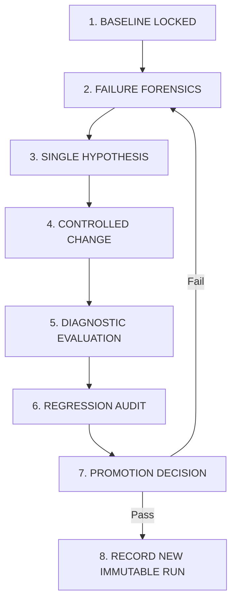

# RAISE Benchmark Protocol & Scientific Integrity Standards

**Document Status**: AUTHORITATIVE PROTOCOL  
**Version**: 1.0.0  
**Compliance Mandate**: Strictly Enforced Across All Runs  
**Evaluation Engines**: Mode A (Retrieval) & Mode B (End-to-End RAG)

---

## 1. Fundamental Principles & Non-Negotiable Rules

To ensure every benchmark result is verifiable, reproducible, and scientifically valid, every evaluation must adhere to the following non-negotiable rules:

1. **First Principle**: **Zero Pipeline Code Modification Prior to Baseline**. The production code must never be modified before establishing and locking the baseline.
2. **Immutable Runs**: Once written to PostgreSQL 16 and disk, an evaluation run record (`run_id`) is strictly immutable. Never overwrite historical runs.
3. **No Benchmark Cheating or Hardcoding**:
   - Production retrieval, chunking, and reasoning code must remain strictly benchmark-agnostic.
   - Prohibit hardcoded expected answers, entity lists, graph triples, passage IDs, or magic query-matching rules in the application codebase.
   - Evaluator metadata and gold answers/evidence exist exclusively within the evaluation runner and must never be exposed to the pipeline under test.
4. **Leakage & Contamination Auditing**:
   - Benchmark runs must execute in isolated session namespaces (`EVAL::{benchmark}::{run_id}`).
   - Questions and answers from Benchmark Run $N$ must never become persistent semantic memory or cache entries that influence Benchmark Run $N+1$.
   - Redis cache keys must incorporate full configuration hashes (corpus, embedding model, weights, prompt template) to prevent stale cache hits across differing configurations.
5. **No Synthetic Shortcuts**:
   - Every benchmark must execute against the real production stack: live ChromaDB vector store, live Neo4j database, live BM25 index, live BGE reranker, and the full LangGraph state machine.
   - Never substitute NetworkX for Neo4j, MiniLM for BGE-Large, or mocked LLMs for production inference during benchmark certification.
6. **Separation of Modes**:
   - Mode A (Retrieval Evaluation) and Mode B (End-to-End RAG Evaluation) measure different layers and must never be collapsed into a single blended score.

---

## 2. Evaluation Modes

### 2.1 MODE A: Multi-Substrate Retrieval & Ranking

Mode A isolates candidate discovery, multi-substrate fusion (RRF), and cross-encoder reranking. No LLM generation tokens are consumed.

```text
Query 
  │
  ├── Dense Vector Search (ChromaDB + BGE-Large, top-K)
  ├── Sparse Lexical Search (BM25, top-K)
  └── Subgraph Extraction (Neo4j Cypher / 1-to-2 Hop Neighbors)
  │
  ▼
Reciprocal Rank Fusion (RRF, k=60, dynamic table boost)
  │
  ▼
Cross-Encoder Reranking (BGE-Reranker-Large)
  │
  ▼
Ranked Candidate Passages [Top-1 to Top-10]
```

**Evaluated Metrics**:
- $\text{Recall}@K$ ($K \in \{1, 5, 10, 20, 100\}$): Fraction of gold supporting passages present in the top-$K$ candidates.
- $\text{nDCG}@10$: Normalized Discounted Cumulative Gain over graded relevance judgments:
  $$\text{DCG}@10 = \sum_{i=1}^{10} \frac{2^{\text{rel}_i} - 1}{\log_2(i + 1)}, \quad \text{nDCG}@10 = \frac{\text{DCG}@10}{\text{IDCG}@10}$$
- $\text{MRR}@10$: Mean Reciprocal Rank of the first relevant passage:
  $$\text{MRR}@10 = \frac{1}{|Q|} \sum_{q=1}^{|Q|} \frac{1}{\text{rank}_q}$$
- $\text{MAP}@100$: Mean Average Precision across ranked retrieved passages.
- **False Promotion Rate**: Fraction of irrelevant passages falsely elevated into the top-4 context.
- **False Suppression Rate**: Fraction of relevant gold passages suppressed out of the top-8 reranked context.

---

### 2.2 MODE B: Complete End-to-End RAG

Mode B exercises the full stateful system, evaluating answer correctness, reasoning, grounding, and provenance.

```text
Query
  │
  ▼
Query Intake & Coreference Resolution (QueryIntakeEngine)
  │
  ▼
Classification & Routing Node (Fast / Expert / Cypher / Community)
  │
  ▼
Multi-Substrate Retrieval & RRF Fusion
  │
  ▼
Cross-Encoder Reranking
  │
  ▼
Response Synthesis (LLM Prompt with Structured Citations)
  │
  ▼
Runtime Faithfulness Quality Gate (FineCat ModernBERT NLI + Math Engine)
  │
  ├── Faithfulness >= 0.80 ──► Citation Validation ──► Final Verified Answer
  └── Faithfulness < 0.80  ──► Query Reformulation (Max 1-2 Retries)
                               └── If still unverified ──► Unverified Responder Refusal
```

**Evaluated Metrics**:
- **Exact Match (EM)**: Binary indicator whether normalized predicted answer matches gold answer string.
- **Token F1**: Precision and Recall over normalized word tokens (lowercased, punctuation stripped, stop articles removed).
- **Supporting Fact F1**: Harmonic mean of Precision and Recall over required supporting document facts / sentences.
- **Hop Completion Rate**: Percentage of multi-hop sub-questions whose intermediate evidence was successfully gathered.
- **Faithfulness Score**: Percentage of synthesized claim sentences confirmed as strictly entailed ($P(\text{Entailment}) \ge 0.60, P(\text{Contradiction}) < 0.20$) by retrieved source chunks via FineCat NLI.
- **Citation Precision & Recall**: Verifying that every inline `[Page N]` citation corresponds to an actual chunk in the prompt containing the cited fact.
- **Numeric Accuracy**: Exact match on financial numbers, percentages, dates, and currency units verified against raw table matrices via IEEE-754 deterministic arithmetic.
- **Unsupported Answer Rate**: Percentage of queries where the system provides an ungrounded hallucination without sufficient retrieved evidence.
- **Safe Abstention Rate**: Percentage of unanswerable trap questions correctly rejected (`INSUFFICIENT_EVIDENCE` or polite refusal) versus attempted fabrication.

---

## 3. Controlled Experimentation Protocol

Every post-baseline modification must follow this strict 8-step cycle:



### 3.1 Experiment Specification Template

Every change must be declared in an immutable record:

```text
EXPERIMENT_ID: EXP-0001
Hypothesis:
  Increasing BM25 lexical weight for queries containing digits from 1.0 to 1.15 improves 
  table balance sheet retrieval recall without degrading prose queries.
Files Changed:
  - backend/src/features/agent/workflow.py
Configuration Changed:
  - RRF weights parameter dynamic dispatch
Target Datasets:
  - Tier 1 RAISE Domain Benchmark (16 locked questions + 824 FRAMES)
Target Metrics:
  - Table Recall@4, Answer EM on Tier 1 table questions
Potential Risks:
  - Slight regression on open-ended semantic policy questions
```

### 3.2 Promotion Criteria & Regression Thresholds

A proposed change is accepted into the production pipeline only if:
1. **Primary Target Metric**: $\Delta \ge +2.0\%$ improvement on target benchmark.
2. **Regression Constraint**: No critical metric degrades by $> -1.0\%$ across any evaluated benchmark tier.
3. **Safety Constraint**: **Unsupported Answer Rate must not increase** ($\Delta \le 0.0\%$).
4. **Grounding Constraint**: Average faithfulness score must remain $\ge 0.80$.
5. **Citation Integrity**: Citation precision must not regress ($\Delta \ge 0.0\%$).
6. **Latency & Resource Limits**: $p95$ query latency must not exceed $15.0$ seconds on Expert mode, and GPU VRAM must remain within single-GPU constraints ($< 24\text{ GB}$).
7. **Reproducibility**: The run must be fully reproducible from its configuration snapshot.

---

## 4. Run Artifacts & Storage Layout

Every execution creates an immutable run bundle on disk and in PostgreSQL:

```text
runs/{run_id}/
├── run_manifest.json          # Complete environment, versions, git commit, hashes
├── config_snapshot.json       # Exact retrieval, RRF, reranker, and LLM hyperparameters
├── raw_results.jsonl          # Per-case inputs, routes, outputs, and latencies
├── retrieval_results.json     # Mode A ranked candidate lists and substrate hits
├── answer_results.json        # Mode B generated answers, EM, F1, and citations
├── failure_cases.jsonl        # Forensic failure cards with 22-category taxonomy tags
├── memory_results.json        # Multi-turn conversational memory recall benchmarks
├── latency_results.json       # Component latency breakdown (p50, p95, p99)
├── baseline_vs_after.json     # Absolute and percentage deltas against baseline
└── report.md                  # Comprehensive human-readable run report
```

### PostgreSQL 16 Authoritative Persistence
All data from the above artifacts is simultaneously committed to PostgreSQL 16:
- `evaluation_runs` (run metadata & manifests)
- `evaluation_cases` (case inputs, outputs, routes)
- `evaluation_retrieval_trace` (per-substrate candidate ranks)
- `evaluation_qa_results` (metrics, NLI scores, citation validity)
- `evaluation_failures` (taxonomy labels, root causes, remediation)
- `memory_evaluation` (memory recall, read/write latency, contamination)
- `session_metadata` & `chat_messages` (replayable conversational transcript)
