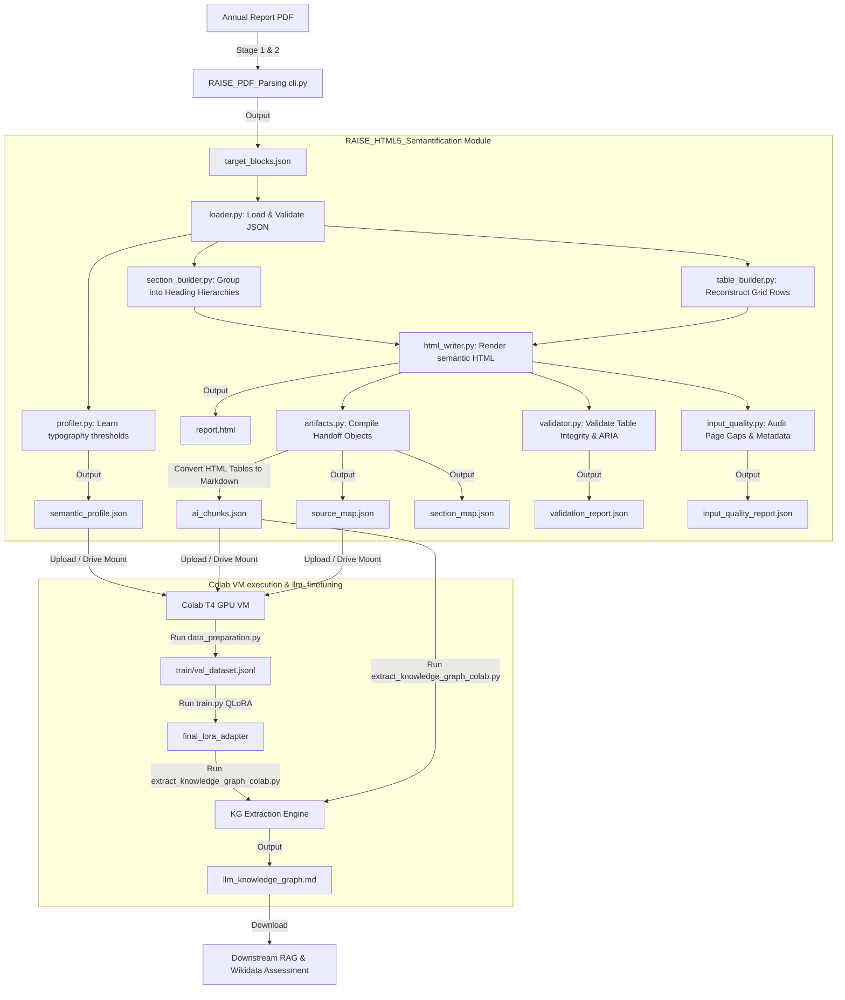

# RAISE HTML5 Semantification

Owner: **Siddharth Tripathi**<br>
Repository: `semanticClimate/RAISE`<br>
Branch: `siddharth-semantification`<br>
Module: `RAISE_HTML5_Semantification/`

This module converts prepared annual-report blocks from JSON into clean, structured, traceable
HTML5. It is the bridge between upstream document preparation and downstream AI-assisted research
assessment.

## 🚀 Unified End-to-End Google Colab Notebook

The unified notebook combines Stage 1 (PDF Parsing), Stage 2 (Noise Filtering), and Stage 3 (HTML5 Semantification) into a single standalone pipeline:

- **Notebook Location**: [`notebooks/RAISE_PDF_Parsing_and_Semantification_Colab.ipynb`](notebooks/RAISE_PDF_Parsing_and_Semantification_Colab.ipynb)
- **Interactive Features**:
  - `pymupdf` layout parsing & noise page filtering
  - Python visual analytics charts (`matplotlib` / `seaborn`)
  - Traceable HTML5 report rendering (`report.html`)
  - AI RAG chunk extraction (`ai_chunks.json`)
  - Interactive output file selector checklist vault

## Position in the RAISE Pipeline & Information Flow

Below is the end-to-end information flow architecture showing the inputs, internal python modules (`.py`), Colab orchestrations, output artifacts, and downstream consumption by the LLM component.



### ⚙️ Information Flow Process & Module Responsibilities

1. **Loader (`loader.py`)**: Consumes the raw block JSON list from upstream parsing, verifying structure and schemas.
2. **Profiler (`profiler.py`)**: Automatically detects the statistical median font size and weights, saving layout settings to `semantic_profile.json` so layouts are processed deterministically.
3. **Section Builder (`section_builder.py`)**: Organizes blocks into a nested tree of headings (H1/H2/H3) and paragraphs, matching organization hierarchies (Faculties → Departments).
4. **Table Builder (`table_builder.py`)**: Translates structured rows or CSV delimiters into standard HTML table structures.
5. **HTML Writer (`html_writer.py`)**: Generates an accessible, compliant, and auditable HTML5 page (`report.html`) complete with page outline sidebars.
6. **Artifacts Compiler (`artifacts.py`)**: Constructs the key handoff structures:
   - `source_map.json`: Binds HTML element IDs to PDF block IDs.
   - `section_map.json`: Tracks structural outline offsets.
   - `ai_chunks.json`: Section-level text fragments. *Critically, table elements are converted to Markdown formatting inside the plain text chunks to preserve structural cells.*
7. **Validator (`validator.py`)**: Runs checks on output elements (ARIA labels, duplicate IDs, broken section outlines, and table column mismatches), outputting `validation_report.json`.
8. **Quality Auditor (`input_quality.py`)**: Reviews metadata completeness (bboxes, fonts, page sequences, and skipped page sequence gaps), outputting `input_quality_report.json`.

---


## Quick Start

From `RAISE_HTML5_Semantification/`:

```bash
uv sync --extra dev

uv run python -m raise_html5_semantification validate \
  --input data/input/target_blocks.json

uv run python -m raise_html5_semantification build \
  --input data/input/target_blocks.json \
  --output data/output/report.html
```

The build command creates all standard outputs under `data/output/`.

## Input

### Expected Location

```text
data/input/target_blocks.json
```

The input can be:

- A JSON array of blocks.
- An object containing `blocks`, `target_blocks`, or `content_blocks` (conforming to the authoritative `target_blocks.schema.json` contract from the parsing stage).
- A supported nested structure containing block-like records.

The default schema `semantic_input.schema.json` is aligned with `target_blocks.schema.json` and `report_blocks.schema.json` (Stage 1 & 2 outputs), supporting strict checks for `source_file`, `blocks`, and `filtering_metadata` (including exclusion records) while remaining flexible enough to load nested alternative structures via schema fallback patterns.


### Recommended Block Fields

| Field | Purpose |
|---|---|
| `block_id` | Stable identifier used for end-to-end source traceability. |
| `page_number` | Original PDF page number. |
| `text` | Original text. It is preserved without summarization. |
| `bbox` | Original bounding box, normally `[x0, y0, x1, y1]`. |
| `reading_order` | Controls document order. |
| `block_type_guess` | Upstream hint such as `heading`, `paragraph`, `table`, or `image`. |
| `font_size`, `font_name` | Support deterministic heading classification. |
| `is_bold`, `is_italic` | Additional layout signals. |
| `confidence` | Upstream parser/OCR confidence. |
| `section_hint` | Optional section classification hint. |
| `rows` or `table` | Already-extracted table structure. |
| `image_path` or `image_src` | Reference to an image already provided upstream. |
| `caption`, `alt_text` | Accessible image description and caption. |

Missing metadata does not automatically stop the build. The module records missing or suspicious
input information in `input_quality_report.json` so upstream problems are visible.

### Text Block Example

```json
{
  "block_id": "page66_block2",
  "page_number": 66,
  "text": "DEPARTMENT OF FINANCE & BUSINESS ECONOMICS",
  "bbox": [72, 100, 510, 132],
  "font_size": 18,
  "font_name": "Times-Bold",
  "is_bold": true,
  "reading_order": 802,
  "block_type_guess": "heading",
  "confidence": 0.98,
  "source_file": "university_annual_report.pdf"
}
```

### Table Block Example

```json
{
  "block_id": "page70_table1",
  "page_number": 70,
  "block_type_guess": "table",
  "reading_order": 910,
  "rows": [
    ["Year", "Publications"],
    ["2023", "42"],
    ["2024", "51"]
  ]
}
```

### Image Block Example

```json
{
  "block_id": "page72_figure1",
  "page_number": 72,
  "block_type_guess": "chart",
  "reading_order": 942,
  "image_path": "images/research_grants.png",
  "caption": "Research grants by year",
  "alt_text": "Bar chart showing annual research grants"
}
```

The module does not extract this image from a PDF. It only renders the upstream image reference.

## Outputs and Their Purpose

| Output | Purpose | Expected downstream use |
|---|---|---|
| `report.html` | Complete semantic HTML5 representation of the report. | Human review, accessibility, section-aware extraction, and auditable evidence. |
| `source_map.json` | Maps every source block to its generated HTML element IDs. | Trace extracted facts back to pages, blocks, tables, figures, or paragraphs. |
| `section_map.json` | Records section hierarchy, page/block boundaries, children, and content counts. | Navigate directly to faculties, departments, and subsections without reparsing HTML. |
| `ai_chunks.json` | Provides section-level HTML and plain-text chunks with pages and block IDs. | Input preparation for a later AI extraction module without sending the whole report at once. |
| `validation_report.json` | Reports structural validity, counts, warnings, and traceability coverage. | Quality gate before downstream extraction. |
| `input_quality_report.json` | Reports missing metadata, OCR noise, TOC blocks, weak tables, and missing image paths. | Diagnose upstream parsing quality without silently modifying upstream content. |
| `semantic_profile.json` | Stores learned deterministic layout thresholds. | Reuse consistent heading behavior on reports with similar layouts. |

Standard paths:

```python
semantic_html_path = "data/output/report.html"
source_map_path = "data/output/source_map.json"
section_map_path = "data/output/section_map.json"
ai_chunks_path = "data/output/ai_chunks.json"
validation_report_path = "data/output/validation_report.json"
input_quality_report_path = "data/output/input_quality_report.json"
semantic_profile_path = "data/output/semantic_profile.json"
```

## Using the Outputs in the Next Stage

The next teammate should use `validation_report.json` as a gate, `ai_chunks.json` as the primary
section-level input, and `source_map.json` to preserve evidence links.

```python
import json
from pathlib import Path

output_dir = Path("data/output")

validation = json.loads((output_dir / "validation_report.json").read_text())
input_quality = json.loads((output_dir / "input_quality_report.json").read_text())

if not validation["ok"]:
    raise RuntimeError("Semantic HTML failed validation")

# Warnings should be reviewed even when validation['ok'] is true.
warnings = [
    issue for issue in validation["issues"] if issue["severity"] == "warning"
]

chunks = json.loads((output_dir / "ai_chunks.json").read_text())
source_map = json.loads((output_dir / "source_map.json").read_text())

publication_chunks = [
    chunk
    for chunk in chunks
    if chunk["recommended_task"] == "publication extraction"
]

for chunk in publication_chunks:
    section_html = chunk["html"]
    source_block_ids = chunk["source_block_ids"]
    source_pages = chunk["source_pages"]
    # Pass section_html to the downstream extraction component.
    # Store source_block_ids and source_pages with every extracted result.
```

This module does not call an LLM. It only prepares deterministic chunks for a later component.

## Traceability Contract

Every meaningful generated element carries source metadata where applicable:

```html
<p
  id="p-page66-block3"
  data-page="66"
  data-source-block="page66_block3"
  data-block-type="paragraph"
  data-bbox="[72, 145, 510, 190]"
  data-confidence="0.930"
  data-reading-order="803"
  data-semantic-role="paragraph">
  Original source text
</p>
```

Tables, table rows, cells, lists, list items, figures, images, captions, headings, and sections also
receive stable IDs and traceability attributes. This lets downstream results reference source
evidence instead of returning unsupported facts.

## Semantic Structure

The generated HTML uses:

- Document structure: `header`, `main`, `article`, `section`, `footer`.
- Headings: `h1`, `h2`, `h3`.
- Content: `p`, `aside`, `ul`, `ol`, `li`.
- Tables: `table`, `caption`, `thead`, `tbody`, `tr`, `th`, `td`.
- Images and uncertain tables: `figure`, `img`, `figcaption`, `pre`.

### Heading Rules

- `FACULTY OF ...` normally becomes `h1`.
- `DEPARTMENT OF ...` normally becomes `h2`.
- Publications, Research Projects, Faculty Strength, Seminars, Patents, and similar subsections
  normally become `h3`.
- TOC dot leaders, number-only financial values, symbol-only blocks, and likely OCR fragments are
  rejected as headings.
- Font size, weight, uppercase text, and section context are deterministic fallback signals.

The visible outline includes `h1` and `h2` by default:

```bash
uv run python -m raise_html5_semantification build \
  --input data/input/target_blocks.json \
  --output data/output/report.html \
  --outline-depth 2
```

Use `--outline-depth 3` for smaller reports. If the requested outline would exceed 300 links, h3
headings remain in the document body but are hidden from the outline.

### Table Behavior

- Already-structured rows become semantic HTML tables.
- Homogeneous lists of objects use stable column ordering.
- Empty cells are preserved and uneven rows are padded.
- Delimited table text can be converted when its structure is clear.
- Unclear table candidates are preserved as text inside `figure > pre`.
- No table extraction from PDFs occurs here.

### Image Behavior

- `image`, `figure`, `chart`, and `diagram` blocks become `figure > img + figcaption`.
- Blocks containing `image_path`, `image_src`, `caption`, or `alt_text` are image-like.
- Missing image paths produce a traceable placeholder instead of dropping the block.
- Missing paths are reported in validation and input-quality outputs.
- No PDF image detection or extraction occurs here.

## Benefits

- **Structure:** Flat parser blocks become navigable faculties, departments, and subsections.
- **Traceability:** Every downstream fact can retain page and source-block evidence.
- **Preservation:** Original text and upstream table/image references are not summarized away.
- **Smaller extraction inputs:** Section chunks avoid sending an entire annual report at once.
- **Quality control:** Validation and input-quality reports expose structural and upstream issues.
- **Accessibility:** Semantic HTML, heading hierarchy, captions, and alternative text improve review.
- **Determinism:** The same prepared input and profile produce reproducible output.
- **Separation of responsibility:** Parsing, semantification, and extraction remain independent.

## Learned Semantic Profile

Learn a profile from a prepared report:

```bash
uv run python -m raise_html5_semantification learn-profile \
  --input data/input/target_blocks.json \
  --output data/output/semantic_profile.json
```

Reuse it for another report with a similar layout:

```bash
uv run python -m raise_html5_semantification build \
  --input data/input/target_blocks.json \
  --output data/output/report.html \
  --profile-input data/output/semantic_profile.json
```

## Other Commands

Inspect block classifications:

```bash
uv run python -m raise_html5_semantification inspect \
  --input data/input/target_blocks.json
```

Run development checks:

```bash
# Code linting
uv run ruff check .

# Code formatting checks
uv run black --check .

# Auto-format code
uv run black .

# Run test suite
uv run pytest
```

### 🛠️ Pre-commit Hooks

This project is configured with `pre-commit` hooks for automatic quality checks (Ruff linting, Ruff formatting, Black code formatting) before code is committed:
```bash
# Install pre-commit hooks locally
uv run pre-commit install

# Run checks manually on all files
uv run pre-commit run --all-files
```


## Colab Workflow

Notebook:

```text
notebooks/RAISE_HTML5_Semantification_Colab.ipynb
```

To run this notebook in Google Colab:
1. Open [Google Colab](https://colab.research.google.com/).
2. Select the **Upload** tab.
3. Upload the local `RAISE_HTML5_Semantification_Colab.ipynb` file from the `notebooks/` directory.

The notebook uploads prepared JSON, runs this module, previews `report.html`, and downloads the
HTML, maps, AI chunks, validation report, input-quality report, and a ZIP of all deliverables.
HTML5 semantification is deterministic CPU work; GPU or TPU acceleration is not required.


## Known Boundaries

- This module starts from `target_blocks.json`.
- It does not parse PDFs.
- It does not filter raw reports.
- It does not extract tables or images from PDFs.
- It does not perform AI extraction or generate final assessment JSON.
- It does not perform CERIF, Wikidata, ROR, or ORCID mapping.
- It preserves and restructures the supplied input.
- Output quality depends on upstream block quality and reading order.
- It reports upstream quality problems rather than attempting to hide or repair them.

## Limitations

- Heading classification can be imperfect when upstream metadata is weak or inconsistent.
- Table quality depends on upstream table labels or usable row/delimiter structure.
- Image rendering depends on valid upstream paths and does not bundle referenced files.
- AI chunks follow detected sections; poor upstream reading order affects their boundaries.
- Validation warnings require human or pipeline review even when `validation_report.json` reports `ok: true`.

