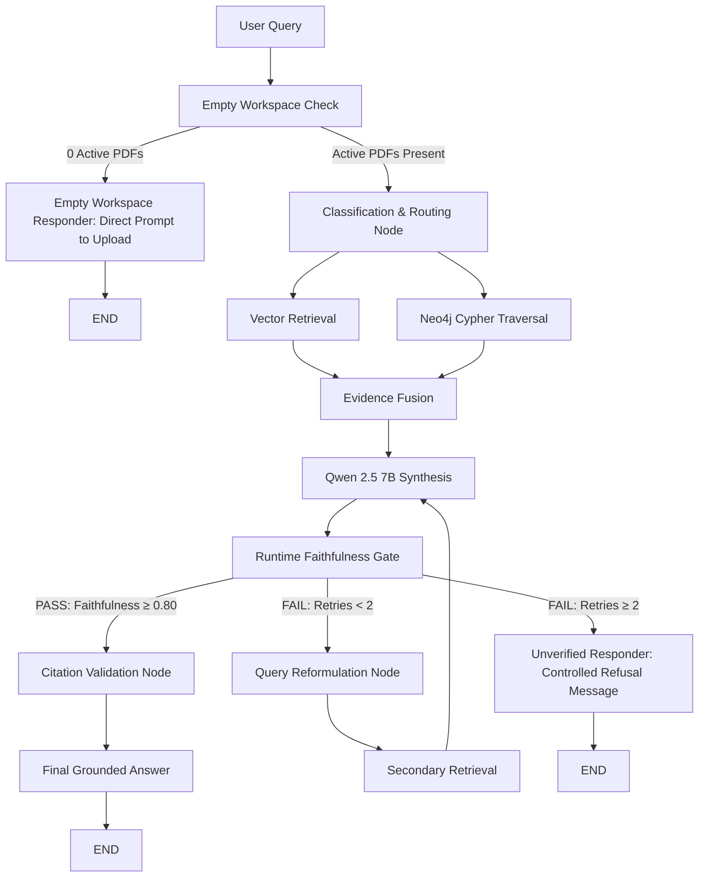

# System Evaluation, Optimization, and Operational Governance

## Architecture Overview: Offline-First Evaluation & Runtime Faithfulness Gate

To preserve RAISE'\''s strict **offline-first invariant** (zero external cloud dependencies, zero data exfiltration), the evaluation and verification architecture is divided into three distinct tiers:

1. **Development & Benchmarking Tier (`LocalHeuristicEvaluator`)**:
   - Calculates local, offline RAGAS-aligned proxy metrics (Faithfulness, Answer Relevance, Context Precision, and Context Recall) over benchmark evaluation datasets.
   - Distinct from the official cloud-based RAGAS package (which relies on remote LLM APIs by default).
2. **Runtime Verification & Claim Grounding Tier (`ClaimLevelVerifier`, `NumericalClaimVerifier`, `CitationValidator`)**:
   - Executes lightweight, deterministic verification on every live response.
   - Decomposes answers into discrete claims and verifies numerical metrics, entity references, and page-level citation pointers against retrieved vector passages and Neo4j graph triples.
3. **Hard Grounding Quality Gate in LangGraph (`RuntimeFaithfulnessQualityGate`)**:
   - Enforces a strict faithfulness threshold ($\ge 0.80$).
   - Manages a self-correction retry loop capped at **2 retries** (3 total attempts).
   - If unverified after 2 retries, delivers a safe refusal message rather than confident-looking hallucinations.
   - Bypasses retrieval, Neo4j, and LLM synthesis entirely when the active workspace contains 0 PDFs.

---

## 1. The Four Offline RAGAS-Aligned Evaluation Metrics

### 1. Faithfulness (Claim-Level Anti-Hallucination)
- **Formulation**:
  $$\text{Faithfulness} = \frac{|\text{Verified Claims Supported by Context \& Graph Facts}|}{|\text{Total Claims in Response}|}$$
- **Operational Rule**: A claim is rejected if it contains uncorroborated numerical values, mismatched organizations/entities, or lacks contextual grounding.

### 2. Answer Relevance
- **Formulation**:
  $$\text{Answer Relevance} = \min\left(1.0, \frac{|\text{Substantive Query Keywords in Answer}|}{|\text{Total Query Keywords}|} + 0.30\right)$$

### 3. Context Precision (Signal-to-Noise Ratio)
- **Formulation**:
  $$\text{Context Precision} = \frac{1}{|R|} \sum_{k \in R} \frac{\text{Relevant Count up to rank } k}{k}$$
  where $R$ is the set of ranks containing relevant evidence.

### 4. Context Recall (Retrieval Completeness)
- **Formulation**:
  $$\text{Context Recall} = \frac{|\text{Ground-Truth Reference Facts Present in Retrieved Context}|}{|\text{Total Ground-Truth Reference Facts}|}$$

---

## 2. Runtime LangGraph Quality Gate Flowchart

---

## 3. Strict Verification Guardrails

1. **Numerical Claim Verification**:
   - Extracts all numbers, currency values (e.g. `₹45 Lakhs`), percentages, and years from the generated text.
   - Ignores bracketed citation markers (e.g. `[1]`, `[[1]]`).
   - If any number in the generated response is absent or contradicted in the evidence (e.g. `₹450 Lakhs` vs `₹45 Lakhs`), the claim is immediately flagged as a `NUMERICAL_MISMATCH` and fails the quality gate.

2. **Citation Validation**:
   - Every bracketed citation index `[N]` must resolve to a valid retrieved passage.
   - Referenced documents must be present in the active document workspace.

3. **Safe Refusal on Verification Failure**:
   - If an answer cannot be grounded after 2 retries, the system outputs:
     *"I could not verify this answer against the uploaded academic sources. Please upload additional relevant material or refine the question."*
   - Prevents ungrounded speculation from ever reaching the user.
