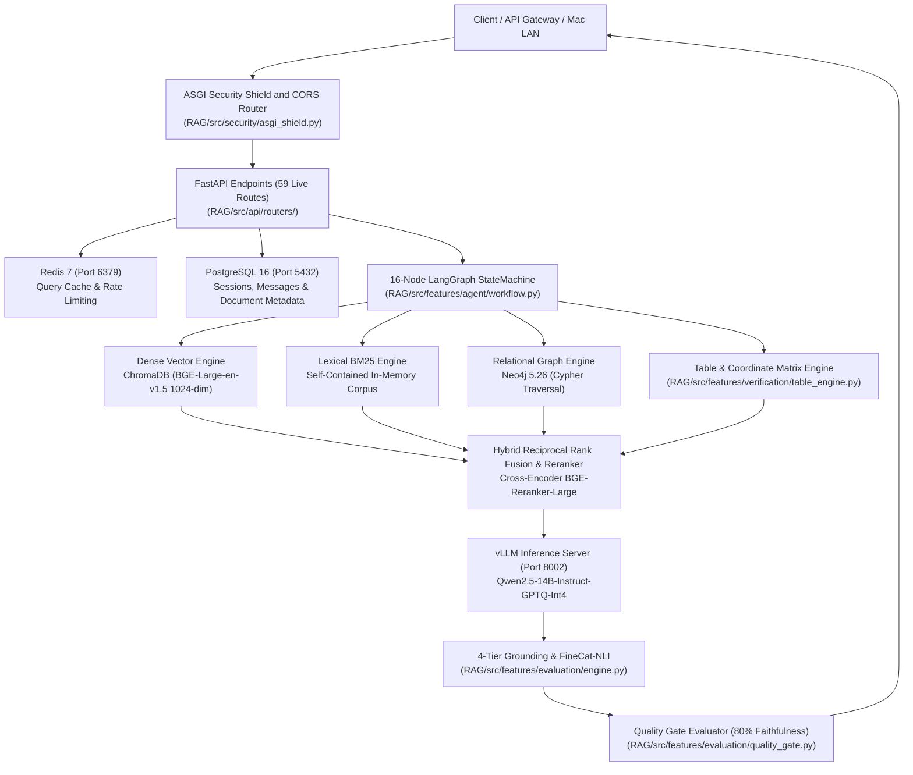

# RAISE Architecture — Master System Specification

**Version**: 2.5.0  
**Status**: CANONICAL & AUTHORITATIVE  
**Verification Date**: 2026-09-14  

---

## 1. Executive Summary

**RAISE (Research Assessment Intelligence & Semantic Extraction)** is an institutional-grade **GraphRAG & RAG** platform. It provides fine-grained, verifiable answers to complex queries over dense technical reports, university audits, and institutional research records with strict page-level citation and zero tolerance for fabricated hallucinations.

The system is strictly **backend-driven**, exposing REST and Server-Sent Events (SSE) APIs built with **FastAPI**, an asynchronous **16-node LangGraph** execution state machine, embedded vector search with **ChromaDB**, knowledge graph traversal with **Neo4j**, long-term persistence with **PostgreSQL 16**, sub-millisecond caching with **Redis 7**, and high-throughput inference powered by **Qwen 2.5 14B** via a local or containerized **vLLM** engine.

---

## 2. High-Level Subsystem Topology



---

## 3. Heterogeneous Tri-Engine Architecture

```text
                                 RAISE
                                   │
                         Python / FastAPI Layer
                         (Orchestration & APIs)
                                   │
                   ┌───────────────┴───────────────┐
                   ↓                               ↓
              Layer 2: Rust                  Layer 3: GPU/CUDA
             (CPU Acceleration)                 (AI Engine)
                   │                               │
            ┌──────┴──────┐                 ┌──────┴──────┐
            ↓             ↓                 ↓             ↓
      GGAHC Chunking    BM25 Search   BGE Embeddings   vLLM / Qwen
      Graph Analytics   RRF Ranking   Tensor Ops       Local Inference
      Text Dedup/Hash   Deterministic
                        Evaluations
                   │                               │
                   └───────────────┬───────────────┘
                                   ↓
                       Storage & Database Layer
             ┌─────────────────────┼─────────────────────┐
             ↓                     ↓                     ↓
         ChromaDB                Neo4j               PostgreSQL
     (Dense Vectors)        (Property Graph)      (Audit / Relational)
             │                     │                     │
             └─────────────────────┼─────────────────────┘
                                   ↓
                              Redis Cache
                           (Sub-ms Sessions)
```

### Layer Allocation & Responsibilities

| Layer | Technology | Key Components & Responsibilities |
| :--- | :--- | :--- |
| **Layer 1: Python Application** | FastAPI, LangGraph, Python 3.13 | • FastAPI REST & SSE endpoints, Docling layout ingestion, PyTorch / Transformers / Sentence-Transformers integration, Provider SDKs, vLLM clients, Neo4j driver, ChromaDB driver, LangGraph cyclical workflows, Configuration, Ingestion pipeline orchestration. |
| **Layer 2: Rust Acceleration** | `raise_engine` (PyO3 + C-ABI) | • Graph-Guided Adaptive Hierarchical Chunking (GGAHC), Text normalization & PDF hyphen repair, Chunk deduplication (SimHash + FNV-1a), SHA-256 fingerprinting, Compact Inverted Index & Okapi BM25, Candidate pre-ranking, Reciprocal Rank Fusion (RRF), Adjacency graph construction & Label Propagation (LPA). |
| **Layer 3: GPU / CUDA** | vLLM, TensorRT / AutoAWQ, CUDA 12.4+ | • Local LLM inference (`Qwen2.5-14B-Instruct-GPTQ-Int4` on port 8002), Dense vector embeddings (`BAAI/bge-large-en-v1.5` on `cuda:0` / `cpu`), Cross-Encoder reranking (`BAAI/bge-reranker-large`), FineCat-NLI ModernBERT inference (`dleemiller/finecat-nli-l`). |
| **Storage Layer** | PostgreSQL 16, Neo4j 5.26, ChromaDB, Redis 7 | • Multi-hop knowledge graph (Neo4j 5.26 with APOC), Dense vector store (ChromaDB HNSW), Relational audit logs & sessions (PostgreSQL 16), Sub-millisecond cache (Redis 7). |

---

## 4. Subsystem Inventory & Port Map

| Subsystem | Port | Protocol | Purpose in RAISE | Source File |
| :--- | :--- | :--- | :--- | :--- |
| **FastAPI Backend** | `8000` | HTTP / SSE | Core REST API, Chat SSE Streaming, Document Management | `RAG/app.py`, `RAG/src/api/routers/` |
| **PostgreSQL 16** | `5432` | TCP / Postgres | Documents metadata, chat sessions, message history, audit trails | `RAG/src/infrastructure/database/postgres.py` |
| **Redis 7** | `6379` | RESP | Sliding-window chat context, query result caching, token-bucket rate limiter | `RAG/src/infrastructure/cache/redis.py` |
| **Neo4j Community 5.26** | `7687` (Bolt)<br/>`7474` (HTTP) | Bolt / HTTP | Knowledge graph traversal, multi-hop Cypher queries, entity subgraphs | `RAG/src/infrastructure/graph/neo4j.py` |
| **vLLM Engine** | `8002` | HTTP / OpenAI | Local GPU inference for `Qwen2.5-14B-Instruct-GPTQ-Int4` | `RAG/src/infrastructure/providers/llm.py` |
| **ChromaDB Vector Store** | In-Process / Ephemeral | Python API | 1024-dim dense vector search with HNSW cosine distance | `RAG/src/infrastructure/vector/chroma.py` |
| **Cloudflare Tunnel** | Outbound | HTTPS / gRPC | Secure zero-trust tunnel exposing local backend to remote frontends | `RAG/server.py` |

---

## 5. Canonical Architecture Map

The table below traces every transition in the end-to-end question answering pipeline to its exact code file, class, and method, with an explicit operational status indicator:

```text
Query
  │
  ├─► [1. Intent / Planning]
  │
  ├─► [2. Retrieval Dispatch]
  │
  ├─► [3. Entity Resolution]
  │
  ├─► [4. Tri-Substrate Retrieval (Vector / BM25 / Graph)]
  │
  ├─► [5. Evidence Integration & Fusion]
  │
  ├─► [6. Deterministic Reasoning]
  │
  ├─► [7. LLM Synthesis]
  │
  ├─► [8. Claim Extraction]
  │
  ├─► [9. Grounding / FineCat NLI]
  │
  ├─► [10. Quality Gate]
  │
  ├─► [11. Citation / Provenance Binding]
  │
  └─► [12. Final Answer & Safe Abstention]
```

### Stage-by-Stage Implementation Matrix

| Pipeline Transition | Exact Source File | Responsible Class / Function | Operational Status | Notes / Behavioral Realities |
| :--- | :--- | :--- | :--- | :--- |
| **1. Query $
ightarrow$ Intent / Planning** | `RAG/src/features/query/intake.py`<br/>`RAG/src/features/agent/router.py` | `QueryIntakeEngine.analyze_query()`<br/>`IntentRouter.classify()` | **OPERATIONAL** | Classifies query intent (`campus_query`, `financial`, `conversational`). Multi-hop subquery decomposition exists in `reasoning.py` but is **DISCONNECTED** in direct benchmark evaluation. |
| **2. Intent $
ightarrow$ Retrieval Dispatch** | `RAG/src/retrieval/parallel_retriever.py` | `ParallelRetriever.retrieve()` | **OPERATIONAL** | Concurrent scatter-gather retrieval across configured substrates. |
| **3. Query $
ightarrow$ Entity Resolution** | `RAG/src/features/ingestion/academic_extractor.py`<br/>`RAG/evaluation/benchmarks/frames/runners/runner.py` | `AcademicEntityExtractor.extract_entities()`<br/>`_fetch_wikipedia_passages()` | **OPERATIONAL** (Campus)<br/>**PARTIAL** (FRAMES) | Campus pipeline uses 13+ regex/spaCy entity extractors. FRAMES evaluation uses exact Wikipedia article title substring matching without entity disambiguation or alias resolution. |
| **4a. Tri-Substrate $
ightarrow$ Dense Vector** | `RAG/src/infrastructure/vector/chroma.py` | `ChromaDBManager.query()` | **OPERATIONAL** | Queries ChromaDB collection using `BAAI/bge-large-en-v1.5` embeddings (1024 dimensions). |
| **4b. Tri-Substrate $
ightarrow$ Lexical BM25** | `RAG/src/retrieval/pipeline.py` | `SelfContainedBM25.search()` | **OPERATIONAL** | In-memory Okapi BM25 implementation scanning active document token sets. |
| **4c. Tri-Substrate $
ightarrow$ Relational Graph** | `RAG/src/infrastructure/graph/neo4j.py`<br/>`RAG/evaluation/benchmarks/frames/isolation/harness.py` | `Neo4jManager.run_cypher()`<br/>`IsolatedFramesHarness.retrieve_graph_only()` | **OPERATIONAL** | Neo4j Cypher queries for production campus data; in-memory NetworkX 2-hop traversal for ephemeral evaluation sandboxes. |
| **5. Substrates $
ightarrow$ Evidence Integration** | `RAG/src/retrieval/fusion.py` | `reciprocal_rank_fusion()`<br/>`CrossEncoderModelSingleton.predict()` | **OPERATIONAL** | Reciprocal Rank Fusion ($k=60$) with table weight boosting, followed by `BAAI/bge-reranker-large` scoring with thread-safe GPU singleton cache. |
| **6. Evidence $
ightarrow$ Deterministic Reasoning** | `RAG/src/features/verification/math_engine.py` | `DeterministicMathEngine.calculate()` | **OPERATIONAL** (Tables)<br/>**DISCONNECTED** (Narrative) | High-precision IEEE-754 calculation for tabular data. Currently disconnected from narrative date/chronology reasoning in unstructured multi-hop queries. |
| **7. Evidence $
ightarrow$ LLM Synthesis** | `RAG/src/infrastructure/providers/llm.py`<br/>`RAG/evaluation/benchmarks/frames/isolation/harness.py` | `vLLMClient.generate_stream()`<br/>`IsolatedFramesHarness.generate_answer()` | **OPERATIONAL** | Direct HTTP connection to local vLLM serving `Qwen2.5-14B-Instruct-GPTQ-Int4` on port 8002. Emits structured chain-of-thought and `Final Answer: ...`. |
| **8. Synthesis $
ightarrow$ Claim Extraction** | `RAG/src/features/evaluation/engine.py` | `extract_atomic_claims()` | **OPERATIONAL** | Splits response text into atomic propositional statements and extracts numerical/temporal tokens. |
| **9. Claims $
ightarrow$ Grounding / FineCat NLI** | `RAG/src/features/evaluation/nli_verifier.py`<br/>`RAG/src/features/evaluation/engine.py` | `FineCatNLIVerifier.verify()`<br/>`verify_claims()` | **OPERATIONAL** | ModernBERT-Large (8k context) FP16 inference on `cuda:0` evaluating claims across 4-tier escalation gating with Tri-State routing ($P(C) \ge 0.50$, $P(E) \ge 0.60 \land P(C) < 0.20$, else NEUTRAL). |
| **10. Claims $
ightarrow$ Quality Gate** | `RAG/src/features/evaluation/quality_gate.py` | `evaluate_quality_gate()` | **OPERATIONAL** | Computes faithfulness ratio ($\ge 0.80$). Rejects answers with numerical discrepancies or uncorroborated assertions. |
| **11. Claims $
ightarrow$ Citation Binding** | `RAG/src/features/verification/claim_verifier.py` | `bind_citations()` | **OPERATIONAL** | Binds in-line numerical citations `[N]` to verified physical document pages (`#page=N`). |
| **12. Output $
ightarrow$ Final Answer / Abstention** | `RAG/src/api/routers/chat.py`<br/>`RAG/evaluation/benchmarks/frames/isolation/harness.py` | `stream_chat_response()`<br/>`generate_answer()` | **OPERATIONAL** | Emits answer tokens and final envelope. If multi-hop reasoning path is unestablished, triggers **Controlled Safe Abstention** (`INSUFFICIENT REASONING PATH`). |
