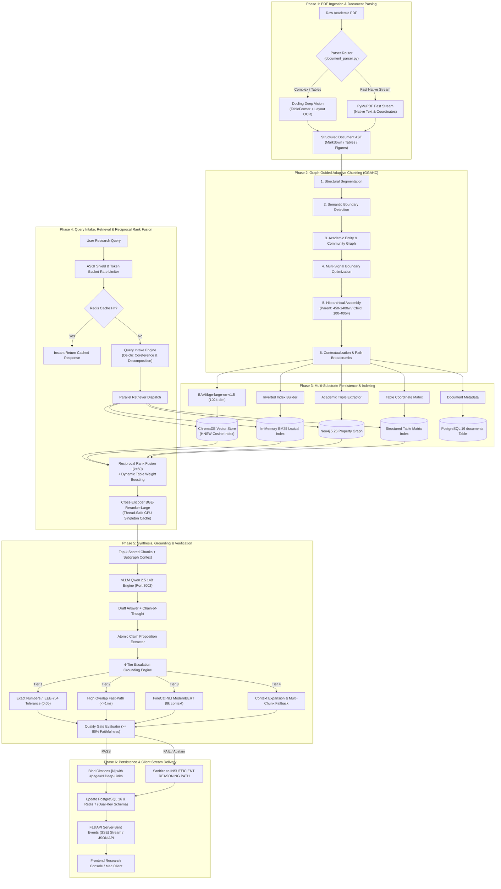

# RAISE Data Flow Specification

**Version**: 2.5.0  
**Status**: CANONICAL & AUTHORITATIVE  
**Verification Date**: 2026-09-14  

---

## 1. End-to-End Data Lifecycle

Data in RAISE traverses six distinct phases from raw academic document ingestion to real-time client consumption:



---

## 2. Ingestion & Indexing Data Contracts

### A. GGAHC Chunk Schema (`RAG/src/chunking/models.py`)

Every document chunk emitted by the 8-stage pipeline conforms to `ProcessedChunk`:

```python
class ProcessedChunk:
    chunk_id: str                   # e.g., "doc_123_p14_c02"
    document_id: str                # UUID or filename of source PDF
    text: str                       # Contextualized text content
    plain_text: str                 # Uncontextualized raw excerpt
    chunk_type: str                 # "prose" | "table" | "figure" | "code"
    token_count: int                # Token length (tiktoken / transformers)
    parent_chunk_id: Optional[str]  # Parent macro-chunk ID (450-1400 tokens)
    page_number: int                # Physical PDF page number (1-based)
    printed_page_number: Optional[int] # Printed report page number
    section_path: List[str]         # e.g., ["Chapter 3", "Financial Statement", "Revenue"]
    entities: List[str]             # Extracted entity strings
    table_matrix: Optional[Dict]    # Row/column structured data if chunk_type == "table"
    hash: str                       # SHA-256 fingerprint for deduplication
```

---

## 3. Query & Retrieval Telemetry Data Contracts

### A. ClaimVerificationRecord (`RAG/src/features/evaluation/engine.py`)

Every evaluated claim is audited using `ClaimVerificationRecord`:

```python
class ClaimVerificationRecord:
    claim_text: str                 # The atomic claim proposition
    status: str                     # "SUPPORTED" | "CONTRADICTION" | "UNSUPPORTED"
    grounding_score: float          # Combined overlap score [0.0, 1.0]
    verification_path: str          # DETERMINISTIC | NLI | DETERMINISTIC+NLI | EVIDENCE_EXPANSION+NLI | CONTROLLED_ABSTENTION
    decision_reason: str            # Detailed human-readable causal rationale
    raw_logits: Optional[Dict[str, float]] # {"contradiction": l_c, "neutral": l_u, "entailment": l_e}
    softmax_probs: Optional[Dict[str, float]] # Softmax probabilities summing to 1.0
    calibration_status: str         # "UNVALIDATED_RAW_SOFTMAX"
```
