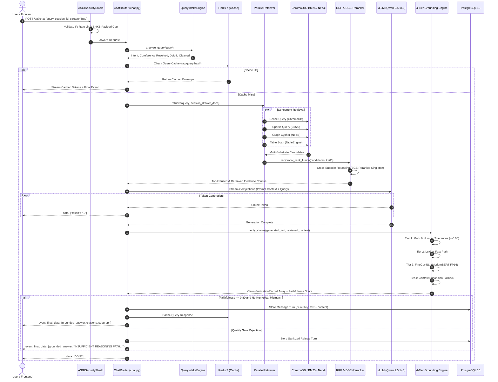
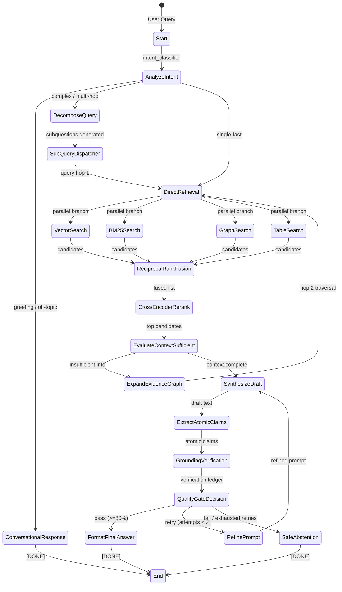

# RAISE Execution Flow Specification

**Version**: 2.5.0  
**Status**: CANONICAL & AUTHORITATIVE  
**Verification Date**: 2026-09-14  

---

## 1. Overview

This document details the exact runtime call stacks, sequence diagrams, and execution paths for:
1. **Interactive Query & Chat Stream Turn** (`POST /api/chat?stream=True`)
2. **LangGraph 16-Node Cyclical Agent Execution**
3. **Isolated Evaluation Sandbox Turn (FRAMES Benchmark)**

---

## 2. Interactive Chat Stream Sequence (`POST /api/chat?stream=True`)

---

## 3. LangGraph 16-Node Cyclical Agent Execution

For complex research and autonomous comparative tasks, RAISE activates the 16-node LangGraph state machine (`RAG/src/features/agent/workflow.py`):

---

## 4. Isolated FRAMES Benchmark Execution Flow

The Google Research FRAMES benchmark runner (`RAG/evaluation/benchmarks/frames/runners/runner.py`) uses an isolated sandbox harness (`IsolatedFramesHarness`):

1. **Question Selection**: `FramesDatasetLoader` extracts questions filtered by reasoning type (`Multi-hop`, `Numerical`, `Temporal`, `Tabular`).
2. **Anti-Leakage Verification**: Asserts that ground-truth reference answers are never indexed into the retrieval corpus.
3. **Ephemeral Ingestion**: Wikipedia articles linked to the target questions are fetched, chunked into section-aware passages, embedded via `bge-large-en-v1.5`, and indexed into an ephemeral ChromaDB collection and in-memory NetworkX graph.
4. **Isolated Hybrid Retrieval**: Executes dense vector search, in-memory BM25, and NetworkX 2-hop graph expansion.
5. **Context Assembly**: Compiles `[Source 1]... [Source 2]... [Knowledge Graph Connections]...`.
6. **vLLM Synthesis**: Calls local vLLM server (`Qwen 2.5 14B`) with temperature `0.0` requesting `Final Answer: <concise answer>`.
7. **Safe Abstention Check**: If reasoning path is unestablished, emits `INSUFFICIENT REASONING PATH: Required reasoning chain could not be established. No answer released.`
8. **Evaluator Scoring**: Evaluates factuality, reasoning, and retrieval coverage without writing to production databases.
