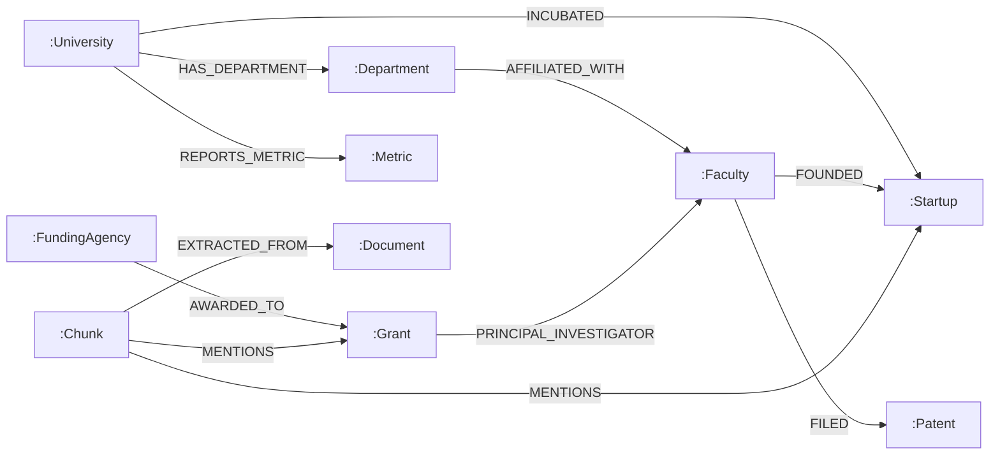

# RAISE Knowledge Graph Reasoning Specification

**Version**: 2.5.0  
**Status**: CANONICAL & AUTHORITATIVE  
**Verification Date**: 2026-09-14  

---

## 1. Graph Substrate Overview

Pure dense vector search struggles with multi-hop relational questions (e.g. *"Which startups incubated under IIT Madras in 2022 secured Department of Science and Technology grants?"*). 

RAISE bridges this limitation by maintaining a **Property Graph in Neo4j 5.26** synchronized with **ChromaDB dense vectors**. Text chunks link directly to knowledge graph entities, enabling Cypher traversal across multi-hop institutional hierarchies.

---

## 2. Neo4j Property Graph Schema

### A. Academic Node Labels

| Node Label | Key Properties | Purpose |
| :--- | :--- | :--- |
| `:University` / `:Institution` | `name`, `nirf_rank`, `location`, `established_year` | Top-level academic institution |
| `:Department` | `name`, `code`, `faculty_count` | Academic department or center |
| `:Faculty` / `:Person` | `name`, `designation`, `h_index`, `department` | Researchers, professors, board members |
| `:Startup` / `:Company` | `name`, `incubation_year`, `sector`, `funding_inr` | Companies incubated in research park |
| `:Grant` / `:Project` | `title`, `agency`, `amount_inr`, `sanction_year` | Sponsored research and consultancy grants |
| `:Patent` | `title`, `patent_no`, `filing_date`, `status` | Intellectual property and filings |
| `:Metric` | `name`, `value`, `year`, `category` | Institutional KPI (student count, revenue) |
| `:Document` | `filename`, `document_id`, `pages_count` | Source annual report |
| `:Chunk` | `chunk_id`, `page_number`, `text_preview` | Retrievable passage bound to graph entities |

### B. Typed Semantic Relationships

---

## 3. Cypher Traversal & AST Security Injection Guard

All Cypher queries generated or executed by RAISE pass through an **AST-level Cypher Injection Firewall** (`RAG/src/security/cypher_guard.py`):
1. **Forbidden Clauses**: `DROP`, `DELETE`, `DETACH`, `CREATE`, `SET`, `REMOVE`, `CALL apoc.system.*`, `LOAD CSV`.
2. **Read-Only Enforcement**: Execution requires Cypher statements to begin with `MATCH` and terminate with deterministic `RETURN` clauses.
3. **Execution Limits**: Hard timeout of 3.0s with max row limit of 50 records to prevent memory exhaustion.

---

## 4. In-Memory NetworkX Graph for Ephemeral Sandboxes

In isolated benchmark environments (such as the Google Research FRAMES evaluation), production Neo4j is bypassed to ensure **strict anti-leakage**:
- An ephemeral directed multigraph (`networkx.MultiDiGraph`) is instantiated in-memory per evaluation session.
- Nodes represent Wikipedia articles and cross-referenced named entities.
- Traversal runs a 2-hop breadth-first search (`successors` and `predecessors`) returning structured subgraphs with edge relations.

---

## 5. Critical Gap: `MENTIONS` Co-Occurrence vs. Typed Semantic Predicates

A critical architectural distinction exists between production campus graphs and benchmark graphs:
- **Production Campus Graph**: Uses typed semantic predicates (`INCUBATED`, `AWARDED_TO`, `AFFILIATED_WITH`), enabling precise multi-hop deductions.
- **FRAMES Benchmark Graph**: Currently generates generic `MENTIONS` co-occurrence edges between Wikipedia article titles. This limits multi-hop graph utility to co-occurrence walks rather than predicate deduction.
