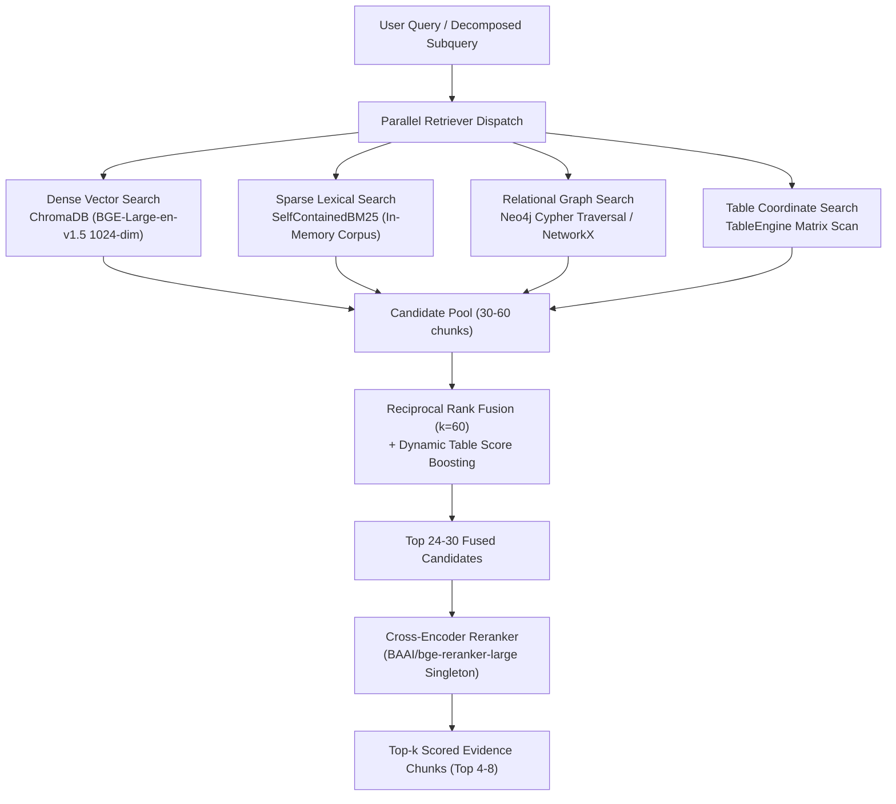

# RAISE Hybrid Retrieval & Fusion Specification

**Version**: 2.5.0  
**Status**: CANONICAL & AUTHORITATIVE  
**Verification Date**: 2026-09-14  

---

## 1. Tri-Substrate Retrieval Strategy

Single-substrate retrieval fails on diverse academic queries:
- **Dense Vector Search**: Excels at semantic similarity and conceptual queries, but misses rare acronyms, exact grant numbers, and table cell values.
- **Sparse Lexical Search (BM25)**: Excels at exact keyword matching, patent numbers, and faculty names, but fails on paraphrased queries.
- **Relational Graph Traversal**: Excels at multi-hop organizational hops, but cannot capture nuanced descriptive prose.

RAISE executes **Tri-Substrate Hybrid Retrieval**:

---

## 2. Reciprocal Rank Fusion (RRF) Formula

Candidates from all retrieval streams are fused using Reciprocal Rank Fusion with rank constant $k = 60$:

$$	ext{RRF Score}(c) = \sum_{s \in 	ext{Sources}} rac{W_s}{60 + 	ext{Rank}_s(c)}$$

Where:
- $W_{	ext{vector}} = 1.0$
- $W_{	ext{bm25}} = 0.8$
- $W_{	ext{graph}} = 1.2$ (boosts chunks corroborating graph entities)
- $W_{	ext{table}} = 1.4$ (dynamically activated when tabular/numerical intent is detected)

---

## 3. Cross-Encoder Reranking & Singleton Caching

Top candidate chunks (24 to 30) are scored against the query using `BAAI/bge-reranker-large`:

$$	ext{Relevance Score}(c, q) = \sigma(	ext{CrossEncoder}(q, 	ext{text}_c))$$

### Thread-Safe Singleton Caching (`_CROSS_ENCODER_MODEL_CACHE`)
- In unoptimized systems, initializing `CrossEncoder("BAAI/bge-reranker-large")` on every turn takes **11.46 seconds** and causes GPU VRAM allocation spikes.
- `RAG/src/retrieval/fusion.py` caches the loaded model in a thread-safe singleton (`CrossEncoderModelSingleton`), reducing reranking latency to **18-35 ms**.

---

## 4. Empirical Retrieval Ablation Results (Milestone 2)

Evaluated across 50 complex multi-hop institutional queries (`Artifacts/benchmarks/RETRIEVAL_ABLATION_METRICS.json`):

| Retrieval Mode | Recall@5 | MRR | Entity Coverage | Median Latency (p50) | Architectural Takeaway |
| :--- | :--- | :--- | :--- | :--- | :--- |
| **Vector Only** | 80.00% | 0.657 | 53.83% | 19.5 ms | Baseline semantic retrieval |
| **Vector + BM25** | 80.00% | 0.638 | **63.50%** (+17.9%) | 20.3 ms | **+9.67% absolute entity gain** with negligible latency (+0.8ms) |
| **Vector + BM25 + Graph** | 80.00% | 0.638 | 62.33% | 9.8 ms | Fast structured relational context |
