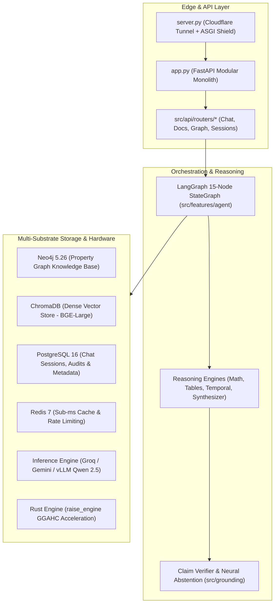

# RAISE Backend: Architecture & Folder-by-Folder Technical Guide

**Target Repository**: `https://github.com/sid0sid-ops/working_raise.git` (Branch: `backend`)  
**Scope**: Complete structural audit of every file, directory, and subpackage.  

---

## 1. High-Level Architecture Overview

RAISE (Research Assessment Intelligence & Semantic Extraction) is structured as a **Multi-Substrate GraphRAG (Graph Retrieval-Augmented Generation) Monolith** backed by FastAPI, LangGraph, Neo4j, ChromaDB, and PostgreSQL.

---

## 2. Root Files

| File | Purpose & Role |
| :--- | :--- |
| **`server.py`** | **Production Edge Server**: Launches FastAPI through an ASGI security shield (`PureASGISecurityShieldMiddleware`), manages Cloudflare subprocess tunnels (`cloudflared`), performs pre-flight port sweeps (kills zombie port 8000 processes), and hosts WebSocket telemetry monitoring. |
| **`app.py`** | **FastAPI Application Definition**: Initializes CORS, registers error handlers, mounts all modular API routers (`src/api/routers/*`), sets dependency injection providers, and manages startup/shutdown lifespan events. |
| **`main.py`** | **Interactive Terminal Studio (User CLI)**: Production terminal runner providing subsystem health diagnostics, active document library management, PDF ingestion, and multi-turn conversational GraphRAG queries. |
| **`dev_main.py`** | **Deep Observability & Developer Console**: Forensic REPL with telemetry frame renderers, honest metric states (`MEASURED`, `DERIVED`, `ESTIMATED`), and database purge/reset tooling. |
| **`requirements.txt`** | Python dependencies (FastAPI, LangGraph, Neo4j, ChromaDB, Docling, PyMuPDF, PyTorch, Transformers). |
| **`Dockerfile`** | Multi-stage production container build (Debian/Python 3.11 with Rust compiler, PyMuPDF, and application server). |
| **`docker-compose.yml`** | Multi-container stack (Postgres, Redis, Neo4j, vLLM, Backend). Currently hardcoded for NVIDIA GPU. |
| **`LLM_PROVIDER_SETUP.md`** | Developer guide documenting Cloud LLM failover (Groq, Gemini, DeepSeek, local vLLM). |

---

## 3. Directory Breakdown: Root Folders

### 📂 `rust/raise_engine/` — Rust Core Acceleration
A native Rust library compiled to a Python extension module via **PyO3** and **Maturin**:
* **`Cargo.toml` / `pyproject.toml`**: Package metadata and release optimization flags (`opt-level = 3`, `lto = true`). *Note: Contains a missing binary reference bug (`src/bin/main.rs`).*
* **`src/lib.rs`**: Library entry point.
* **`src/python.rs` / `src/ffi.rs`**: Python FFI bindings exporting native functions into Python.
* **`src/chunking/`**: High-speed implementation of Graph-Guided Adaptive Hierarchical Chunking (GGAHC).
* **`src/graph/`**: In-memory graph traversal and neighbor extraction.
* **`src/retrieval/`**: Native Rust BM25 scoring and ranking.
* **`src/provenance/`**: Chunk-to-page bounding box and coordinate provenance tracking.
* **`src/text/`**: Fast tokenization and regex sanitization.

### 📂 `scripts/` — Operations, Migrations & Benchmarks
* **`check_health.py`**: Rapid diagnostic ping testing Neo4j Bolt port 7687, ChromaDB vectors, and vLLM model readiness.
* **`ingest_all_four_reports.py`**: Automated batch ingestion for core academic benchmark PDFs.
* **`sync_neo4j_live.py`**: Synchronizes offline NetworkX graph triples into live Neo4j database.
* **`audit_system_integrity.py` / `audit_system_specs.py`**: Validates schema consistency and citation anchors.
* **`repair_ocr_chunks.py`**: Scans ingested chunks for garbled OCR text and repairs them via PyMuPDF.
* **`run_ggahc_full_pdf.py`**: Standalone runner testing GGAHC hierarchical chunking against target PDFs.
* **`purge_substrates_and_runtime.py` / `full_system_reset.py`**: Clean wipe scripts for local caches and vector collections.
* **`launch_vllm.sh` / `launch_vllm.ps1` / `stack.ps1`**: Shell and PowerShell helper scripts to start Docker containers.

### 📂 `prompts/` — System Prompts & Guardrails
* **`system_synthesis.py` & `.md`**: The primary prompt governing final RAG synthesis (mandates in-text citations `[1]`, factual grounding, and tone).
* **`intent_classification.py` & `.md`**: Few-shot prompts classifying queries into `FACTUAL`, `COMPARISON`, `TABLE_LOOKUP`, or `CHITCHAT`.
* **`ingestion_triplet_extraction_prompt.py` & `.md`**: LLM prompts extracting `(Subject, Relation, Object)` knowledge graph triples from document chunks.
* **`retrieval_qa_chat_prompt.py` & `.md`**: Dynamic multi-turn prompt injecting active drawer context and previous turn summaries.
* **`cypher_injection_mitigation.md` / `graph_schema.md` / `qwen_dynamic_schema_tool_guardrails.md`**: Architectural constraints preventing Cypher injection and enforcing schema strictness.
* **`specifications/master_ui_spec.md`**: Master design specification defining API contracts with the frontend.

---

## 4. Directory Breakdown: `src/` (Core Application)

### 📂 `src/api/` — Web API Gateway
* **`context.py`**: In-memory operational state (active query metrics, abort controllers, document library cache, client IP helper).
* **`dependencies.py`**: Dependency injection providers for FastAPI (`get_rag_engine`, `get_postgres_manager`, `get_redis_cache`, `get_document_service`).
* **`schemas.py`**: Pydantic request and response models (`ChatMessageRequest`, `QueryRequest`, `AbortRequest`, `FeedbackRequest`).
* **`routers/`**:
  * **`chat.py`**: Handles `/api/chat` (Fast & Expert mode, SSE streaming, multi-turn conversational memory, citation generation).
  * **`documents.py`**: Handles `/api/upload`, `/api/documents`, `/api/pdf/{filename}`, and ingestion status SSE streams.
  * **`query.py`**: Headless query pipeline (`/api/query`, `/api/query/stream`) and dynamic question suggestions (`/api/suggestions`).
  * **`sessions.py`**: Chat session lifecycle management (`/api/sessions`, `/api/sessions/{id}/messages`).
  * **`graph.py`**: Knowledge graph visualization (`/api/graph`, `/api/subgraph/{id}`, `/api/graph/search`).
  * **`health.py`**: Health & readiness probes (`/api/health`, `/api/health/ready`, `/healthz`).
  * **`developer.py`**: Developer checkups, cache cleaning, and hardware telemetry.
  * **`search.py`**: Raw dense vector search endpoint across ChromaDB chunks.
  * **`agent.py`**: Autonomous multi-step tool agent reasoning endpoint.

### 📂 `src/core/` — Typed Core & Config
* **`config.py`**: Pydantic v2 typed configuration system loading environment variables (`Neo4jConfig`, `VectorConfig`, `LLMConfig`, `PostgresConfig`).
* **`types.py`**: Dataclasses and type aliases (`Chunk`, `Document`, `Entity`, `Relation`, `Citation`).

### 📂 `src/security/` — Defense, Monitoring & Watchdogs
* **`asgi_shield.py`**: Pure ASGI middleware providing sub-microsecond Redis IP blacklist enforcement and non-blocking telemetry queueing.
* **`ip_resolver.py`**: Resolves client WAN IP and Cloudflare edge headers.
* **`handshake_manager.py`**: Ephemeral token handshake for WebSockets and SSE streams with atomic eviction.
* **`port_sweep.py`**: Detects and terminates orphan/zombie processes lingering on port 8000.
* **`process_watchdog.py`**: Subprocess supervisor restarting `cloudflared` tunnels if connection drops.
* **`device_parser.py`**: Parses User-Agent strings into structured device telemetry (Browser, OS, Platform).
* **`outbox_manager.py`**: Transactional outbox ensuring reliable event delivery to Redis.

### 📂 `src/infrastructure/` — Hardware & Third-Party Adapters
* **`database/postgres.py`**: PostgreSQL client managing chat sessions, persistent messages, user feedback, and metadata tables.
* **`cache/redis.py`**: Redis client handling exact-match query caching, token bucket rate limiting, and session state.
* **`vector/chroma.py`**: ChromaDB persistent vector engine with cosine similarity search and HNSW indexing.
* **`graph/neo4j.py`**: Neo4j Bolt driver wrapper executing Cypher transactions with retry logic.
* **`graph/schema.py`**: Neo4j constraint and index creation (`CREATE CONSTRAINT FOR (c:Chunk) REQUIRE c.id IS UNIQUE`).
* **`providers/`**: Pluggable LLM clients:
  * `groq.py` (Groq Cloud API)
  * `gemini.py` (Google Gemini API)
  * `vllm.py` (Local OpenAI-compatible vLLM engine)
  * `deepseek.py` (DeepSeek API)
* **`hardware.py`**: Auto-detects available GPU VRAM, CUDA devices, Apple Silicon Metal (MPS), and system RAM.
* **`credentials/`**: Encryption and credential masking helpers.

### 📂 `src/features/` — Domain Modules (Modular Architecture)
* **`features/agent/`**: The LangGraph 15-node cyclical workflow (`workflow.py` and `router.py`) implementing the full agentic GraphRAG loop.
* **`features/chat/`**: High-level chat service orchestrating memory and reasoning.
* **`features/documents/`**: Document ingestion, status tracking, deletion, and PDF management service.
* **`features/query/`**: Query intake, classification, and suggestion generation.
* **`features/sessions/`**: Session persistence and drawer synchronization.
* **`features/memory/`**: Reasoning memory storing past query trajectories (`reasoning.py` and `engine.py`).
* **`features/verification/`**: 
  * `math_engine.py`: Deterministic math verifier (verifies sums, percentages, CAGR in LLM answers).
  * `table_engine.py`: Table cell extraction and tabular verification.
  * `claim_verifier.py` & `fact_engine.py`: Natural Language Inference (NLI) claim validation.
* **`features/ingestion/`**: PDF parsing coordinator (`pipeline.py`).
* **`features/system/`**: Developer operator diagnostics.
* **`features/comparison/`**: Multi-document comparative analysis service.

### 📂 `src/chunking/` & `src/parsers/` — Document Processing
* **`chunking/pipeline.py`**: GGAHC chunking pipeline splitting PDFs into hierarchical parent-child chunks.
* **`chunking/table_chunker.py`**: Preserves Markdown/HTML table structure during chunking.
* **`chunking/rust_bridge.py`**: PyO3 bridge calling the native Rust engine for ultra-fast chunking.
* **`parsers/docling_parser.py`**: IBM Docling TableFormer parser for deep tabular OCR.
* **`parsers/document_parser.py`**: Fast PyMuPDF layout-aware text and heading extractor.

### 📂 `src/retrieval/` & `src/reasoning/` — Search & Synthesis
* **`retrieval/parallel_retriever.py`**: Parallel retriever querying ChromaDB dense vectors and BM25 sparse keywords simultaneously.
* **`retrieval/fusion.py`**: Reciprocal Rank Fusion (RRF) and Cross-Encoder neural reranking.
* **`retrieval/pipeline.py`**: `StandaloneRAGPipeline` unifying vector search, graph traversal, and LangGraph execution.
* **`reasoning/synthesizer.py`**: Final answer synthesis engine injecting verified citations.
* **`reasoning/numerical.py` / `tables.py` / `temporal.py`**: Domain-specific reasoning operators.
* **`grounding/abstention.py`**: Neural abstention detector (triggers `"INSUFFICIENT_EVIDENCE"` if retrieved context lacks proof).

### 📂 `src/cli/` & `src/gui/` — Interfaces
* **`cli/renderer.py` / `commands.py`**: ANSI color formatting, diagnostic display, and command dispatch for `main.py`.
* **`cli/llm_selector.py`**: Interactive CLI and GUI prompt to switch between Groq, Gemini, and vLLM.
* **`gui/control_panel.py`**: Tkinter lightweight graphical control panel for desktop users.

---

## 5. Architectural Redundancy Analysis (What Backend Dev Needs to Clean)

During the codebase evolution, several modules were refactored into `src/features/`, but their legacy counterparts were kept in `src/`. This causes duplication and confusion:

1. **`src/chunking/` vs `src/features/chunking/`**:
   - `src/features/chunking/__init__.py` simply re-exports `src/chunking`.
   - **Recommendation**: Keep `src/chunking/` as the single source of truth; eliminate redundant wrapper.
2. **`src/services/` vs `src/features/`**:
   - `src/services/chat_service.py`, `document_service.py`, etc., are 5-line forwarding shims to `src/features/*/service.py`.
   - **Recommendation**: Standardize imports on `src.features.*` and deprecate `src/services/`.
3. **`src/retrieval/` vs `src/features/retrieval/`**:
   - Both contain parallel retriever exports.
   - **Recommendation**: Consolidate into `src/retrieval/`.
4. **Dead `RAG.` Package Fallback Imports**:
   - Several files have `try: from prompts... except ImportError: from RAG.prompts...`.
   - **Recommendation**: Delete all `from RAG.` references to prevent confusing runtime errors.
