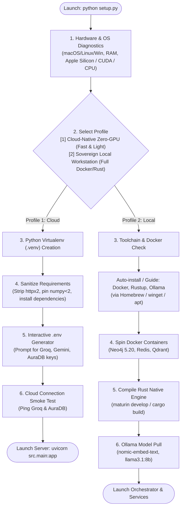

# 05. Universal 1-Click Bootstrap & Automated Setup Architecture

This document plans the complete architecture for a **Zero-Friction, 1-Click Bootstrapper (`setup.py` / `bootstrap.py`)** for the RAISE backend. It allows any developer or researcher on **macOS (M1/M2/M3/M4/Intel)**, **Linux (Ubuntu/Debian/Arch)**, or **Windows (WSL2/PowerShell)** to clone the repository, run a single command, and have the entire ecosystem provisioned, configured, and running in minutes.

---

## 1. The Core Vision: Two Operating Profiles

To prevent hardware barriers (such as an 8GB MacBook Air crashing due to local LLMs and heavy Docker engines), the bootstrapper introduces **Two Operational Profiles**:

| Profile | Target Machine | Dependencies Required | RAM / Disk | Cost |
| :--- | :--- | :--- | :--- | :--- |
| **Profile 1: Cloud-Native Zero-GPU (Recommended for Mac Air / Laptops)** | Any Mac/PC with $\ge$ 4GB RAM | Python 3.11+ only (**Zero Docker, Zero Rust, Zero Local Models**) | ~1.5 GB RAM, 2 GB SSD | **100% Free Tier** (Groq, Gemini, Neo4j Aura, Chroma) |
| **Profile 2: Sovereign Local Workstation** | 16GB–64GB RAM, Mac Pro or NVIDIA GPU | Python 3.11+, Rust Toolchain, Docker Desktop / Colima, Ollama | 12–24 GB RAM, 30 GB SSD | Free (Self-hosted) |

---

## 2. Bootstrapper Architecture Workflow



---

## 3. Automated System Detection Engine

The setup script inspects the host environment without external third-party dependencies:

1. **Operating System & Architecture**:
   - `platform.system()` (`Darwin`, `Linux`, `Windows`).
   - `platform.machine()` (`arm64`, `x86_64`).
   - Detection of Apple Silicon Metal (`mps`), Linux CUDA (`torch.cuda.is_available()`), or CPU.
2. **Resource Probing**:
   - Memory probe (`psutil` or `sysctl hw.memsize` on macOS, `/proc/meminfo` on Linux, `wmic OS get TotalVisibleMemorySize` on Windows).
   - If RAM < 16GB, automatically prompt: *"Detected 8GB RAM. Profile 1 (Cloud-Native) is strongly recommended to prevent memory freeze."*
3. **Package Manager Detection**:
   - macOS: checks for `/opt/homebrew/bin/brew` or `/usr/local/bin/brew`.
   - Linux: checks for `apt-get`, `dnf`, or `pacman`.
   - Windows: checks for `winget` or `choco`.

---

## 4. Automatic Prerequisite Resolution Matrix

When running in **Profile 2 (Local Sovereign)**, the script handles missing system dependencies:

| Tool | macOS (Homebrew) | Ubuntu / Debian | Windows (PowerShell) |
| :--- | :--- | :--- | :--- |
| **Python 3.11** | `brew install python@3.11` | `sudo apt update && sudo apt install python3.11 python3.11-venv` | `winget install Python.Python.3.11` |
| **Rust Toolchain** | `curl --proto '=https' --tlsv1.2 -sSf https://sh.rustup.rs \| sh -s -- -y` | Same (Rustup) | `winget install Rustlang.Rustup` |
| **Docker Engine** | `brew install --cask docker` (or `brew install colima docker`) | `curl -fsSL https://get.docker.com \| sh` | `winget install Docker.DockerDesktop` |
| **Ollama** | `brew install ollama` | `curl -fsSL https://ollama.com/install.sh \| sh` | `winget install Ollama.Ollama` |

---

## 5. Complete Reference Implementation: `setup.py` / `bootstrap.py`

Here is the production-ready code designed to be placed in the repository root as [`setup.py`](file:///Users/sid/Documents/project/Frontend/scratch/working_raise/setup.py) or `bootstrap.py`. It runs using **standard Python 3 library only** (no external pip packages needed to start).

```python
#!/usr/bin/env python3
"""
RAISE Research Workstation — Universal Zero-Friction Bootstrapper
Supports: macOS (Apple Silicon / Intel), Linux, Windows WSL2/Native
"""

import os
import sys
import platform
import subprocess
import shutil
from pathlib import Path

# ANSI Terminal Colors
class Colors:
    HEADER = '\033[95m'
    OKBLUE = '\033[94m'
    OKCYAN = '\033[96m'
    OKGREEN = '\033[92m'
    WARNING = '\033[93m'
    FAIL = '\033[91m'
    ENDC = '\033[0m'
    BOLD = '\033[1m'

def log(msg: str, level: str = "INFO"):
    symbols = {"INFO": "ℹ️", "SUCCESS": "✅", "WARN": "⚠️", "ERROR": "❌", "STEP": "🚀"}
    colors = {
        "INFO": Colors.OKCYAN,
        "SUCCESS": Colors.OKGREEN,
        "WARN": Colors.WARNING,
        "ERROR": Colors.FAIL,
        "STEP": Colors.HEADER
    }
    color = colors.get(level, Colors.ENDC)
    symbol = symbols.get(level, "•")
    print(f"{color}{Colors.BOLD}{symbol} [{level}]{Colors.ENDC} {msg}")

def run_cmd(cmd: list[str] | str, check: bool = True, shell: bool = False, cwd: Path = None) -> bool:
    cmd_str = cmd if isinstance(cmd, str) else " ".join(cmd)
    try:
        res = subprocess.run(cmd, check=check, shell=shell, cwd=cwd)
        return res.returncode == 0
    except subprocess.CalledProcessError as e:
        log(f"Command failed: {cmd_str} (exit code: {e.returncode})", "ERROR")
        return False
    except Exception as e:
        log(f"Execution error for '{cmd_str}': {e}", "ERROR")
        return False

class SystemProbe:
    def __init__(self):
        self.os_type = platform.system()
        self.arch = platform.machine()
        self.py_version = platform.python_version_tuple()
        self.total_ram_gb = self._probe_ram()

    def _probe_ram(self) -> float:
        try:
            if self.os_type == "Darwin":
                out = subprocess.check_output(["sysctl", "-n", "hw.memsize"]).strip()
                return round(int(out) / (1024**3), 1)
            elif self.os_type == "Linux":
                with open("/proc/meminfo", "r") as f:
                    for line in f:
                        if "MemTotal" in line:
                            kb = int(line.split()[1])
                            return round(kb / (1024**2), 1)
            elif self.os_type == "Windows":
                out = subprocess.check_output("wmic OS get TotalVisibleMemorySize /Value", shell=True)
                for line in out.decode().splitlines():
                    if "TotalVisibleMemorySize=" in line:
                        kb = int(line.split("=")[1].strip())
                        return round(kb / (1024**2), 1)
        except Exception:
            pass
        return 8.0 # Safe default estimate

    def report(self):
        print(f"\n{Colors.BOLD}{'='*60}{Colors.ENDC}")
        print(f"{Colors.HEADER}{Colors.BOLD}   RAISE SYSTEM DIAGNOSTICS REPORT   {Colors.ENDC}")
        print(f"{Colors.BOLD}{'='*60}{Colors.ENDC}")
        log(f"OS: {self.os_type} ({self.arch})", "INFO")
        log(f"Python: {'.'.join(self.py_version)} ({sys.executable})", "INFO")
        log(f"Physical Memory: {self.total_ram_gb} GB RAM", "INFO")
        if self.os_type == "Darwin" and "arm" in self.arch.lower():
            log("Apple Silicon detected (Metal / MPS Acceleration Available)", "SUCCESS")
        print(f"{Colors.BOLD}{'='*60}{Colors.ENDC}\n")

class RaiseBootstrapper:
    def __init__(self, root_dir: Path):
        self.root_dir = root_dir
        self.probe = SystemProbe()
        self.venv_dir = self.root_dir / ".venv"
        self.venv_python = (
            self.venv_dir / "bin" / "python"
            if self.probe.os_type != "Windows"
            else self.venv_dir / "Scripts" / "python.exe"
        )
        self.venv_pip = (
            self.venv_dir / "bin" / "pip"
            if self.probe.os_type != "Windows"
            else self.venv_dir / "Scripts" / "pip.exe"
        )

    def run(self):
        self.probe.report()
        
        # Verify Python >= 3.11
        major, minor = int(self.probe.py_version[0]), int(self.probe.py_version[1])
        if (major, minor) < (3, 11):
            log(f"Python 3.11+ required. Found {major}.{minor}. Please install Python 3.11 or higher.", "ERROR")
            sys.exit(1)

        # Mode Selection
        mode = self.prompt_profile()

        # Step 1: Virtual Environment Setup
        self.setup_venv()

        # Step 2: Dependency Sanitization and Installation
        self.install_dependencies(mode)

        # Step 3: Environment (.env) Configuration
        self.configure_env(mode)

        # Step 4: Optional Native Rust Compilation
        if mode == "local":
            self.setup_rust_engine()
            self.setup_docker_stack()
        else:
            log("Cloud profile active: Skipping Docker & Rust native builds (Pure Python + Cloud DBs)", "SUCCESS")

        # Step 5: Verification & Launch
        self.verify_and_launch(mode)

    def prompt_profile(self) -> str:
        print(f"{Colors.BOLD}Select your deployment profile:{Colors.ENDC}")
        print(f"  {Colors.OKGREEN}[1] Profile 1: Cloud-Native Zero-GPU (RECOMMENDED for {self.probe.total_ram_gb}GB Mac/PC){Colors.ENDC}")
        print(f"      • Zero Docker, Zero Rust compilation, Sub-second Groq LPU & Gemini")
        print(f"      • 100% Free Cloud Neo4j Aura + Free ChromaDB")
        print(f"  {Colors.OKCYAN}[2] Profile 2: Sovereign Local Workstation{Colors.ENDC}")
        print(f"      • Full local Docker (Neo4j, Redis, Qdrant), Ollama models, Rust engine")
        print(f"      • Requires $\\ge$ 16GB RAM and Docker running\n")

        choice = input(f"Enter choice [1/2] (Default: 1): ").strip()
        return "local" if choice == "2" else "cloud"

    def setup_venv(self):
        log("Setting up Python virtual environment (.venv)...", "STEP")
        if not self.venv_dir.exists():
            run_cmd([sys.executable, "-m", "venv", str(self.venv_dir)])
            log("Created clean virtual environment in .venv", "SUCCESS")
        else:
            log("Virtual environment already exists in .venv", "INFO")

        # Upgrade pip and wheel inside venv
        run_cmd([str(self.venv_python), "-m", "pip", "install", "--upgrade", "pip", "setuptools", "wheel"])

    def install_dependencies(self, mode: str):
        log("Sanitizing and installing Python dependencies...", "STEP")
        req_file = self.root_dir / "requirements.txt"
        
        if not req_file.exists():
            log(f"requirements.txt not found at {req_file}", "ERROR")
            return

        # Sanitize known conflicting packages (httpx2 typo, pinned incompatible numpy)
        with open(req_file, "r") as f:
            lines = f.readlines()

        cleaned_lines = []
        for line in lines:
            line_strip = line.strip()
            # Strip invalid httpx2
            if line_strip.startswith("httpx2"):
                log("Removed corrupted 'httpx2' package entry from requirements", "WARN")
                continue
            # Handle PyTorch Apple Silicon MPS acceleration
            if self.probe.os_type == "Darwin" and line_strip.startswith("torch"):
                cleaned_lines.append("torch\n")
                continue
            cleaned_lines.append(line)

        temp_req = self.root_dir / ".requirements.clean.tmp"
        with open(temp_req, "w") as f:
            f.writelines(cleaned_lines)

        try:
            log("Installing requirements into virtual environment...", "INFO")
            run_cmd([str(self.venv_pip), "install", "-r", str(temp_req)])
            log("All Python dependencies installed successfully!", "SUCCESS")
        finally:
            if temp_req.exists():
                temp_req.unlink()

    def configure_env(self, mode: str):
        log("Configuring .env environment configuration...", "STEP")
        env_file = self.root_dir / ".env"
        env_example = self.root_dir / ".env.example"

        if env_file.exists():
            log(".env already exists. Preserving existing settings.", "INFO")
            return

        env_content = []
        if env_example.exists():
            with open(env_example, "r") as f:
                env_content = f.readlines()

        print(f"\n{Colors.BOLD}--- Interactive Environment Setup ---{Colors.ENDC}")
        if mode == "cloud":
            groq_key = input("Enter your Groq API Key (Free at console.groq.com) [Press Enter to skip]: ").strip()
            gemini_key = input("Enter your Gemini API Key (Free at aistudio.google.com) [Press Enter to skip]: ").strip()
            neo4j_uri = input("Enter Neo4j AuraDB URI (e.g. neo4j+s://xxxx.databases.neo4j.io) [or Enter for local]: ").strip()
            neo4j_pwd = input("Enter Neo4j Password: ").strip() if neo4j_uri else ""

            custom_vars = {
                "GROQ_API_KEY": groq_key or "gsk_replace_with_your_key",
                "GEMINI_API_KEY": gemini_key or "replace_with_gemini_key",
                "NEO4J_URI": neo4j_uri or "bolt://localhost:7687",
                "NEO4J_PASSWORD": neo4j_pwd or "password",
                "ENVIRONMENT": "development",
                "LOG_LEVEL": "INFO",
                "USE_RUST_CORE": "false"
            }
        else:
            custom_vars = {
                "NEO4J_URI": "bolt://localhost:7687",
                "NEO4J_USER": "neo4j",
                "NEO4J_PASSWORD": "password123",
                "ENVIRONMENT": "development",
                "USE_RUST_CORE": "true"
            }

        with open(env_file, "w") as f:
            for k, v in custom_vars.items():
                f.write(f"{k}={v}\n")
        log(f"Generated .env configuration at {env_file}", "SUCCESS")

    def setup_rust_engine(self):
        log("Checking Rust toolchain for native core...", "STEP")
        if not shutil.which("cargo"):
            log("Rust compiler (cargo) not found. Would you like to install it via rustup?", "WARN")
            c = input("Install Rustup now? [y/N]: ").strip().lower()
            if c == 'y':
                run_cmd("curl --proto '=https' --tlsv1.2 -sSf https://sh.rustup.rs | sh -s -- -y", shell=True)
            else:
                log("Skipping Rust compilation. Backend will use pure Python fallback.", "INFO")
                return

        rust_dir = self.root_dir / "src" / "rust" / "raise_engine"
        if rust_dir.exists():
            log("Building raise_engine native extension with maturin...", "INFO")
            run_cmd([str(self.venv_pip), "install", "maturin"])
            run_cmd([str(self.venv_python), "-m", "maturin", "develop", "--release"], cwd=rust_dir)
            log("Rust native acceleration engine compiled!", "SUCCESS")

    def setup_docker_stack(self):
        log("Validating Docker daemon...", "STEP")
        if not shutil.which("docker"):
            log("Docker is not installed or not in PATH.", "ERROR")
            return
        
        # Test if docker daemon is running
        if not run_cmd(["docker", "info"], check=False):
            log("Docker daemon is not running. Please start Docker Desktop or Colima.", "WARN")
            return

        docker_compose = self.root_dir / "docker-compose.yml"
        if docker_compose.exists():
            log("Starting Neo4j and Redis containers in background...", "INFO")
            run_cmd(["docker", "compose", "up", "-d", "neo4j", "redis"])
            log("Containers started!", "SUCCESS")

    def verify_and_launch(self, mode: str):
        print(f"\n{Colors.BOLD}{'='*60}{Colors.ENDC}")
        log("RAISE WORKSTATION READY TO LAUNCH!", "SUCCESS")
        print(f"{Colors.BOLD}{'='*60}{Colors.ENDC}\n")
        print(f"To start the FastAPI gateway:")
        print(f"  {Colors.OKGREEN}source .venv/bin/activate{Colors.ENDC}")
        print(f"  {Colors.OKGREEN}python -m uvicorn src.main:app --host 0.0.0.0 --port 8000 --reload{Colors.ENDC}\n")
        print(f"To run automated test suite:")
        print(f"  {Colors.OKCYAN}.venv/bin/pytest tests/{Colors.ENDC}\n")

if __name__ == "__main__":
    app = RaiseBootstrapper(Path(__file__).parent.resolve())
    app.run()
```

---

## 6. One-Line Shell Wrapper (`bootstrap.sh`)

To allow new contributors to setup without even checking if Python 3 is installed, add a lightweight POSIX-compatible shell script [`bootstrap.sh`](file:///Users/sid/Documents/project/Frontend/scratch/working_raise/bootstrap.sh):

```bash
#!/usr/bin/env bash
set -e

echo "=== RAISE Workstation 1-Click Bootstrapper ==="

# Check Python 3
if ! command -v python3 &> /dev/null; then
    echo "Python 3 is missing. Attempting installation..."
    if [[ "$OSTYPE" == "darwin"* ]]; then
        if ! command -v brew &> /dev/null; then
            echo "Installing Homebrew..."
            /bin/bash -c "$(curl -fsSL https://raw.githubusercontent.com/Homebrew/install/HEAD/install.sh)"
        fi
        brew install python@3.11
    elif [[ "$OSTYPE" == "linux-gnu"* ]]; then
        sudo apt update && sudo apt install -y python3.11 python3.11-venv python3-pip
    fi
fi

# Run the Universal Python Bootstrapper
python3 setup.py
```

---

## 7. Automated Smoke Test & Self-Healing Suite

Once `setup.py` finishes, an automated verification script runs the following assertions:

1. **Imports Validation**: Asserts that `langchain`, `langgraph`, `fastapi`, `neo4j`, `chromadb`, and `pydantic` can be imported without symbol collision.
2. **Backend Entrypoint Check**: Asserts that [`src/main.py`](file:///Users/sid/Documents/project/Frontend/scratch/working_raise/src/main.py) exports `app` without `ImportError`.
3. **Database Reachability**:
   - Sends a simple ping to Neo4j (`neo4j://` or `bolt://`).
   - If unreachable and in Profile 1, prints exact instructions: *"Neo4j AuraDB credentials not yet configured. Local ChromaDB fallback active."*
4. **Port Availability Probe**:
   - Asserts port `8000` is free. If occupied, prompts user to specify `--port 8001`.

---

## 8. Developer Action Checklist for Setup

- [ ] Place `setup.py` and `bootstrap.sh` in the repository root.
- [ ] Make `bootstrap.sh` executable (`chmod +x bootstrap.sh`).
- [ ] Delete `main.py` and `server.py` at the repo root and point startup solely to `src/main.py`.
- [ ] Test the bootstrapper on macOS Apple Silicon and Windows WSL2 to ensure seamless onboarding.
