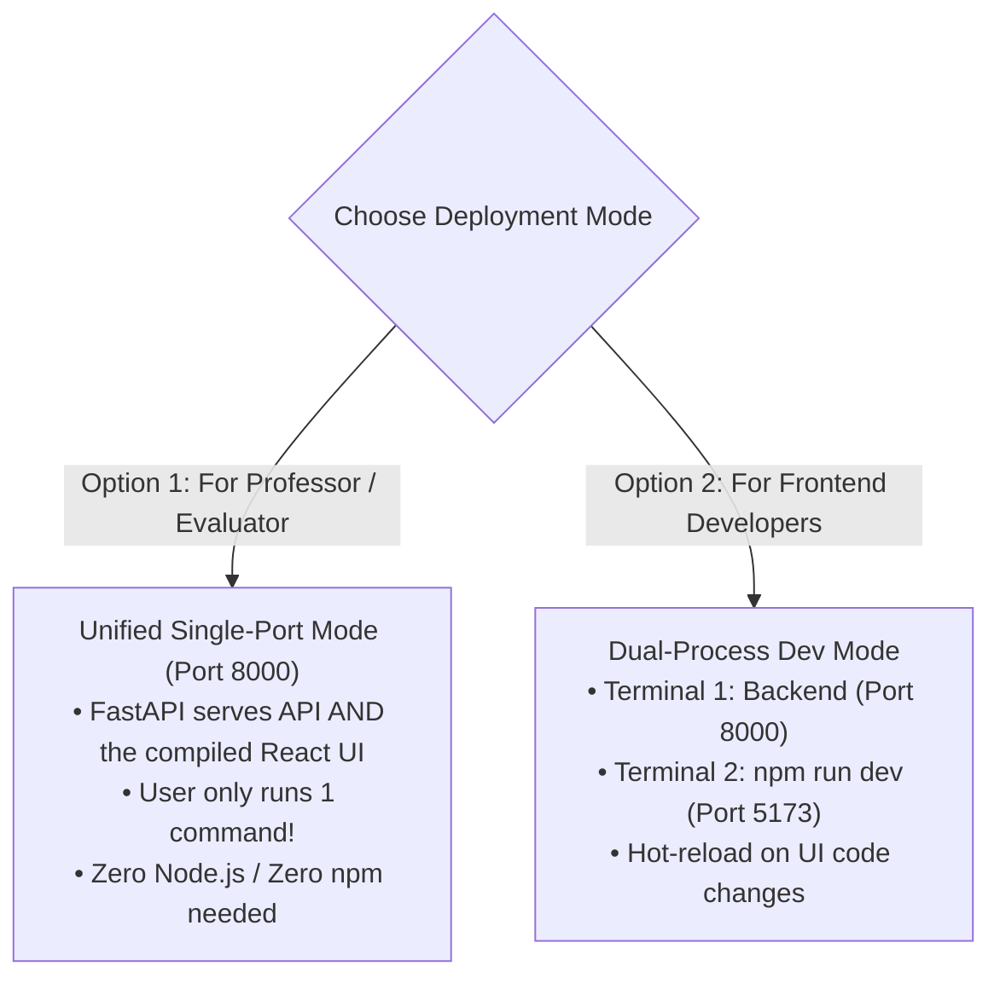

# 09. Frontend UI Integration & Connectivity Architecture

This guide explains how to connect and run the **RAISE Frontend UI** with the **FastAPI Backend** so that anyone (including your professor or team members) gets a visual research interface with zero friction.

---

## 1. The Good News: The Frontend Is Already Built!

The frontend workspace you are currently in (`/Users/sid/Documents/project/Frontend`) is the official **RAISE React 19 Research Workstation**.

### Features Included in the Frontend:
* 🌐 **Interactive Knowledge Graph Canvas** ([`src/components/graph/`](file:///Users/sid/Documents/project/Frontend/src/components/graph)): 2D force-directed interactive node visualization connected to Neo4j.
* 💬 **Streaming Chat & Epistemic Citations** ([`src/components/chat/`](file:///Users/sid/Documents/project/Frontend/src/components/chat)): Live streaming SSE responses with grounded citations.
* 📚 **PDF Document Library & Viewer** ([`src/components/library/`](file:///Users/sid/Documents/project/Frontend/src/components/library)): Drag-and-drop PDF ingestion with deep page linking (`#page=N`).
* ⚙️ **Hardware Telemetry & Settings** ([`src/features/settings/`](file:///Users/sid/Documents/project/Frontend/src/features/settings)): Live monitoring of GPU memory, RAM, and database health.

The frontend is already pre-configured in [`src/app/config.ts`](file:///Users/sid/Documents/project/Frontend/src/app/config.ts) and [`src/stores/modeStore.ts`](file:///Users/sid/Documents/project/Frontend/src/stores/modeStore.ts) to connect directly to:
👉 **`http://localhost:8000`**

---

## 2. Two Ways to Run the Frontend + Backend



---

## 3. Option 1: Unified Single-Port Mode (The 1-Click Professor Experience)

> **Best For**: Sharing with your professor or demoing. She only starts the Python server, and the entire React UI loads automatically in her browser at `http://127.0.0.1:8000`! **She does NOT need Node.js or `npm` installed!**

### How it Works:
1. The frontend is already compiled into pure HTML/CSS/JS inside the [`dist/`](file:///Users/sid/Documents/project/Frontend/dist) directory.
2. In the backend ([`src/main.py`](file:///Users/sid/Documents/project/Frontend/scratch/working_raise/src/main.py)), FastAPI mounts the `dist` directory to serve static assets.

### Implementation for the Backend Developer:
Add these 5 lines to [`src/main.py`](file:///Users/sid/Documents/project/Frontend/scratch/working_raise/src/main.py):

```python
import os
from pathlib import Path
from fastapi.staticfiles import StaticFiles
from fastapi.responses import FileResponse

# Locate frontend static build directory
FRONTEND_DIST = Path(__file__).resolve().parent.parent / "dist"

if FRONTEND_DIST.exists():
    # Mount assets (JS, CSS, images)
    app.mount("/assets", StaticFiles(directory=str(FRONTEND_DIST / "assets")), name="assets")

    # Serve React SPA index.html on root and unknown routes
    @app.get("/{full_path:path}")
    async def serve_spa(full_path: str):
        file_path = FRONTEND_DIST / full_path
        if file_path.is_file():
            return FileResponse(file_path)
        return FileResponse(FRONTEND_DIST / "index.html")
```

### The Result:
1. The user runs **one command**:
   ```bash
   uvicorn src.main:app --port 8000
   ```
2. When they open **`http://localhost:8000`** in Chrome/Safari:
   * The **Full React 19 UI** loads instantly.
   * All API calls (`/api/v1/query`, `/api/documents`) resolve internally to the same server.
   * **Zero CORS issues, zero second terminals, zero Node.js required!**

---

## 4. Option 2: Independent Development Mode (Hot-Reloading)

> **Best For**: When you or a frontend developer are actively designing, editing components, or styling Tailwind CSS.

### Terminal 1: Start the Backend (Port 8000)
```bash
cd scratch/working_raise
source .venv/bin/activate
uvicorn src.main:app --host 127.0.0.1 --port 8000 --reload
```

### Terminal 2: Start the Frontend (Port 5173)
```bash
cd /Users/sid/Documents/project/Frontend
npm run dev
```

Vite will start the live development server:
👉 **`http://localhost:5173`**

Any changes you make to `.tsx` or `.css` files update live on your screen within milliseconds.

---

## 5. Ensuring CORS Compatibility

To ensure the Vite development server (`http://localhost:5173`) can communicate with the backend (`http://localhost:8000`) without browser security blocks, ensure [`src/main.py`](file:///Users/sid/Documents/project/Frontend/scratch/working_raise/src/main.py) includes `CORSMiddleware`:

```python
from fastapi.middleware.cors import CORSMiddleware

app.add_middleware(
    CORSMiddleware,
    allow_origins=[
        "http://localhost:5173",
        "http://127.0.0.1:5173",
        "http://localhost:8000",
        "http://127.0.0.1:8000",
    ],
    allow_credentials=True,
    allow_methods=["*"],
    allow_headers=["*"],
)
```

---

## 6. How to Package the Frontend for Submission

When you bundle the repository to share with your professor:

1. **Build the latest frontend static bundle**:
   ```bash
   npm run build
   ```
   *(This updates the `dist/` directory with the latest UI code).*
2. **Copy `dist/` into the backend repository root**:
   ```bash
   cp -r dist/ scratch/working_raise/dist/
   ```
3. When your professor double-clicks `run.bat` or runs `./run.sh`, the backend starts and serves the frontend on **`http://localhost:8000`** automatically!
