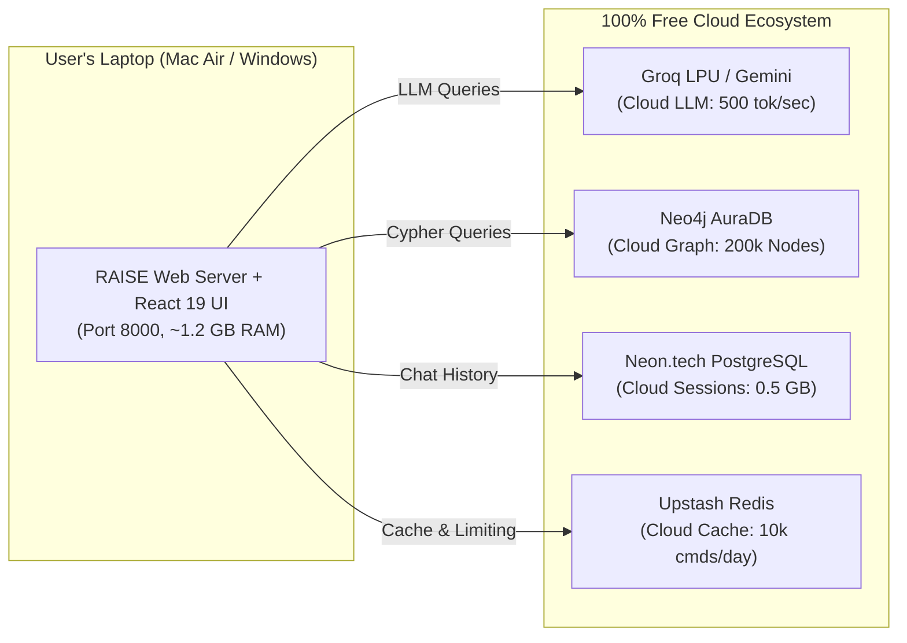

# 11. Native Local Neo4j (Without Docker) & The Full Cloud Ecosystem

This guide answers two critical deployment questions:
1. **Can a user download and run Neo4j locally WITHOUT Docker?** *(Yes, via Neo4j Desktop or native package managers).*
2. **How to configure the "Full Cloud Ecosystem"** (Cloud LLM + Cloud Neo4j Aura + Cloud Neon Postgres + Cloud Upstash Redis) so that the entire research workstation runs without consuming local RAM or disk.

---

## 1. Running Neo4j Locally WITHOUT Docker

If you or a user cannot use cloud databases and **do not want to install Docker**, you can run Neo4j natively on your operating system just like any regular software (e.g. Chrome, Spotify).

```mermaid
flowchart TD
    User(["Local User (No Docker)"]) --> ChooseOS{"Select Installation Method"}
    
    ChooseOS -->|Option A: Friendly GUI (Recommended)| Desktop["Neo4j Desktop Application\n• Official 1-click installer (.exe on Windows, .dmg on Mac)\n• Bundles Java JVM automatically (zero Java setup)\n• Graphical UI to start/stop database"]
    
    ChooseOS -->|Option B: CLI Package Manager| CLI["Native Package Manager\n• macOS: brew install neo4j\n• Windows: winget install Neo4j\n• Linux: sudo apt install neo4j"]
    
    ChooseOS -->|Option C: Zero-Install Fallback| Fallback["Pure ChromaDB Vector Fallback\n• If Neo4j is not installed, RAISE automatically\n  falls back to dense vector search via ChromaDB"]

    Desktop --> LocalBolt(["Runs natively on bolt://localhost:7687"])
    CLI --> LocalBolt
```

---

### Method A: Neo4j Desktop (The 1-Click GUI App) — *Recommended*

Neo4j Desktop is an official desktop app with an embedded Java runtime. You do **not** need to install Java manually.

#### On Windows:
1. Download **Neo4j Desktop** for Windows from [neo4j.com/download](https://neo4j.com/download/).
2. Run the downloaded `.exe` installer.
3. Open Neo4j Desktop:
   * Click **"New Project"** $\rightarrow$ Click **"Add Database"** $\rightarrow$ **"Local DBMS"**.
   * Set Password to: `password123` (or match your `.env`).
   * Click **"Start"**.
4. The database is now running locally on `bolt://localhost:7687`!

#### On macOS:
1. Download **Neo4j Desktop** `.dmg` for Apple Silicon or Intel from [neo4j.com/download](https://neo4j.com/download/).
2. Drag Neo4j to your `Applications` folder and open it.
3. Click **"New DBMS"**, set password to `password123`, and click **"Start"**.

---

### Method B: Native Command Line (No GUI, No Docker)

If you prefer lightweight command line services:

* **On macOS (via Homebrew)**:
  ```bash
  # Install native Apple Silicon Neo4j
  brew install neo4j

  # Start the background service
  neo4j start

  # Stop anytime with:
  # neo4j stop
  ```
* **On Windows (via Winget)**:
  ```powershell
  winget install NeoTechnology.Neo4jCommunityServer
  ```
* **On Linux (Ubuntu / Debian)**:
  ```bash
  sudo apt update
  sudo apt install -y openjdk-17-jdk
  wget -O - https://debian.neo4j.com/neotechnology.gpg.key | sudo apt-key add -
  echo 'deb https://debian.neo4j.com stable latest' | sudo tee /etc/apt/sources.list.d/neo4j.list
  sudo apt update && sudo apt install -y neo4j
  sudo systemctl start neo4j
  ```

---

### What if a User Does NOT Want to Install Neo4j at All?
RAISE was architected with a **Dense Vector Fallback** in [`src/core/rag_pipeline.py`](file:///Users/sid/Documents/project/Frontend/scratch/working_raise/src/core/rag_pipeline.py):
* If Neo4j is offline or not installed, the 15-node LangGraph pipeline automatically routes document queries to **ChromaDB**.
* ChromaDB runs directly inside Python as a local SQLite file (`./data/chroma`).
* **The application will not crash; it answers using semantic vector retrieval.**

---

## 2. The Complete 100% Free Cloud Ecosystem

If a user wants **all cloud services** with zero local installations, here is the full map of providers, their role, and their 100% free allowance:



### Complete Cloud Service Breakdown:

| Layer | Free Cloud Provider | What It Does in RAISE | Free Limits |
| :--- | :--- | :--- | :--- |
| **1. AI Reasoning** | **[Groq](https://console.groq.com)** + **[Gemini](https://aistudio.google.com)** | Generates answers, extracts entities, synthesizes citations | **Groq**: 30 RPM (sub-second)<br>**Gemini**: 15 RPM (1M context) |
| **2. Knowledge Graph** | **[Neo4j AuraDB Free](https://neo4j.com/cloud/platform/aura-graph-database/)** | Stores entity nodes, relationships, and multi-hop graph paths | **200,000 Nodes**<br>**400,000 Relationships** |
| **3. Relational DB** | **[Neon.tech](https://neon.tech)** | Stores persistent chat history, sessions, user feedback | **0.5 GB Storage**<br>(~500,000 messages) |
| **4. Fast Cache** | **[Upstash Redis](https://upstash.com)** | Semantic caching of identical queries, rate limits, abort signals | **10,000 commands / day**<br>**256 MB RAM** |
| **5. Vector Storage** | **ChromaDB (Local File)** | Vector similarity search (stores embeddings as a file on disk) | Unlimited (Local file) |

---

## 3. The 3 Master Deployment Profiles in the Universal Launcher

The universal installer (`setup.py` / `launch.bat` / `launch.sh`) now offers 3 distinct profiles:

```text
==============================================================================
      RAISE RESEARCH WORKSTATION - DEPLOYMENT CONFIGURATOR
==============================================================================

Select your deployment setup:

  [1] 100% Free Cloud Ecosystem (RECOMMENDED)
      • Cloud LLM (Groq / Gemini) + Cloud Graph (Neo4j Aura)
      • Cloud Postgres (Neon) + Cloud Redis (Upstash)
      • ZERO Docker, ZERO local databases, uses ~1.2 GB RAM.
      • Best for: MacBook Air, Windows laptops, professors, quick demos.

  [2] Native Sovereign Local (100% Offline, ZERO Docker)
      • Local LLM via Ollama (Llama 3.2 3B or Qwen 2.5 7B)
      • Native Neo4j Desktop or CLI (no Docker container)
      • In-Memory fallback for Postgres and Redis.
      • Best for: Private research, offline flights, machines with 8GB–16GB RAM.

  [3] Full Production Docker Stack
      • Docker Compose spins up Neo4j 5.26, Postgres 16, Redis 7, Qdrant, vLLM.
      • Best for: Institutional servers, cloud VMs, 32GB+ Linux workstations.

Enter choice [1/2/3] (Default: 1): 
```

---

## 4. Master `.env` for Full Cloud Ecosystem

```bash
# ==============================================================================
# RAISE MASTER CONFIGURATION: 100% CLOUD ECOSYSTEM
# ==============================================================================

# Core Application
ENVIRONMENT=development
LOG_LEVEL=INFO
USE_RUST_CORE=false

# 1. Cloud LLM Inference
LLM_BACKEND=groq
GROQ_API_KEY=gsk_your_groq_key_here
GEMINI_API_KEY=your_gemini_key_here

# 2. Cloud Knowledge Graph (Neo4j AuraDB Free)
NEO4J_URI=neo4j+s://your-instance.databases.neo4j.io
NEO4J_USER=neo4j
NEO4J_PASSWORD=your_aura_password_here
NEO4J_DATABASE=neo4j

# 3. Cloud Relational Database (Neon.tech Free Serverless Postgres)
POSTGRES_HOST=ep-cool-fog-123456-pooler.us-east-2.aws.neon.tech
POSTGRES_PORT=5432
POSTGRES_DB=neondb
POSTGRES_USER=your_neon_username
POSTGRES_PASSWORD=your_neon_password
POSTGRES_SSLMODE=require

# 4. Cloud Fast Cache (Upstash Free Serverless Redis)
REDIS_HOST=your-endpoint.upstash.io
REDIS_PORT=6379
REDIS_PASSWORD=your_upstash_password
REDIS_SSL=true

# 5. Local Vector Storage (Pure In-Memory / File - Zero Server)
VECTOR_DB_TYPE=chroma
CHROMA_PERSIST_DIR=./data/chroma
```

---

## 5. Master `.env` for Native Local Mode (Zero Docker, Zero Cloud)

```bash
# ==============================================================================
# RAISE MASTER CONFIGURATION: NATIVE LOCAL (ZERO DOCKER, ZERO CLOUD)
# ==============================================================================

# Core Application
ENVIRONMENT=development
LOG_LEVEL=INFO
USE_RUST_CORE=false

# 1. Local LLM Inference (Ollama)
LLM_BACKEND=ollama
OLLAMA_BASE_URL=http://localhost:11434
OLLAMA_MODEL=llama3.2:3b

# 2. Native Local Neo4j (Installed via Neo4j Desktop or Homebrew)
NEO4J_URI=bolt://localhost:7687
NEO4J_USER=neo4j
NEO4J_PASSWORD=password123
NEO4J_DATABASE=neo4j

# 3. Relational & Cache (Uses Automatic In-Memory Fallback - No Install Needed!)
POSTGRES_HOST=localhost
REDIS_HOST=localhost

# 4. Local Vector Storage (Pure In-Memory / File - Zero Server)
VECTOR_DB_TYPE=chroma
CHROMA_PERSIST_DIR=./data/chroma
```

---

## 6. Summary: Which Setup Should You Recommend?

| User Persona | Recommended Profile | Software to Install | RAM Needed |
| :--- | :--- | :--- | :--- |
| **Professor / Reviewer** | **Profile 1 (Cloud)** | Python only (Double-click `run.bat` or `launch.sh`) | **~1.2 GB** |
| **Developer with Mac Air / Windows** | **Profile 1 (Cloud)** | Python only | **~1.2 GB** |
| **Offline Researcher (No WiFi)** | **Profile 2 (Native Local)** | Python + Ollama + Neo4j Desktop (**Zero Docker**) | **~6 GB – 8 GB** |
| **University Dedicated Server** | **Profile 3 (Full Docker)** | Docker Desktop / Docker Engine | **16 GB – 32 GB** |
