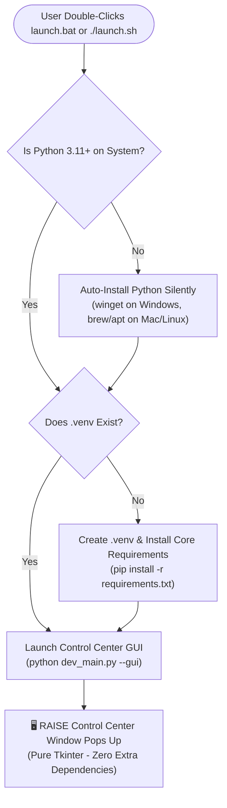

# 12. Universal Control Center GUI & First-Run Setup Wizard Plan

This document plans the expansion of [`src/gui/control_panel.py`](file:///Users/sid/Documents/project/Frontend/scratch/working_raise/src/gui/control_panel.py) into the **RAISE Universal Control Center & Setup Wizard**.

It allows any user (first-time evaluator, professor, or advanced researcher) on **macOS, Windows, or Linux** to visually configure models, paste API keys, select cloud vs local databases, inspect download sizes, understand fallbacks, and launch the system **without editing code or `.env` files manually**.

---

## 1. First-Run Bootstrap Flow: From Zero to GUI



---

## 2. Enhanced Control Center Architecture (`src/gui/control_panel.py`)

The existing 810-line OLED Black Control Center is expanded with **4 dedicated, user-friendly tabs**:

```text
┌─────────────────────────────────────────────────────────────────────────────┐
│ 🔧 RAISE AI WORKSTATION — MISSION CONTROL & CONFIGURATOR                   │
├─────────────────┬─────────────────┬────────────────────┬────────────────────┤
│ 1. AI Models    │ 2. Databases    │ 3. Key Locker      │ 4. System Launch   │
└─────────────────┴─────────────────┴────────────────────┴────────────────────┘
```

---

### Tab 1: AI Engine & Model Calculator (Cloud vs Local)

This tab lets the user choose between **Cloud Speed** and **Offline Privacy**, with live download size calculations:

```text
[•] Option A: 100% Free Cloud LLM (RECOMMENDED)
    Provider: [ Groq LPU (Sub-second) ▼ ]
    Model:    Llama 3.3 70B Versatile (Free Tier)
    RAM Used: ~1.2 GB | Download Size: 0 GB (Instant)
    API Key:  [ gsk_****************************** ] [ Test Key 🔑 ]

[ ] Option B: Sovereign Local LLM (100% Offline & Private)
    Engine:   [ Ollama (Local Service) ▼ ]
    Select Model:
      ( ) Llama 3.2 3B  ─── Download: 2.0 GB │ RAM: 4GB–8GB (Best for Mac Air)
      (•) Qwen 2.5 7B   ─── Download: 4.7 GB │ RAM: 16GB+
      ( ) Llama 3.1 8B  ─── Download: 4.9 GB │ RAM: 16GB+
    
    [ 📥 Download & Pull Model via Ollama ]  Status: Ready / Not Installed
```

---

### Tab 2: Multi-Substrate Database Matrix & Fallback Explainer

For each database, the user can choose **Cloud**, **Native Local**, or **In-Memory Fallback**. It explicitly educates the user on what happens if a module is skipped:

```text
┌─ Knowledge Graph (Neo4j) ──────────────────────────────────────────────────┐
│ (•) Cloud (Neo4j AuraDB Free) ─ URI: neo4j+s://xxxx.databases.neo4j.io     │
│ ( ) Native Local (Neo4j Desktop / brew) ─ Port: 7687                       │
│ ( ) None / In-Memory Fallback                                              │
│                                                                            │
│ ℹ️ WHAT HAPPENS IF DISABLED:                                               │
│ RAISE automatically routes queries to ChromaDB Dense Vector Search.        │
│ The application will NOT crash; it answers using semantic document chunks. │
└────────────────────────────────────────────────────────────────────────────┘

┌─ Persistent Chat & Sessions (PostgreSQL) ──────────────────────────────────┐
│ (•) Cloud (Neon.tech Serverless Free) ─ Host: ep-cool-fog.neon.tech        │
│ ( ) Native Local PostgreSQL ─ Port: 5432                                   │
│ ( ) None / In-Memory Fallback (RECOMMENDED FOR QUICK DEMO)                 │
│                                                                            │
│ ℹ️ WHAT HAPPENS IF DISABLED:                                               │
│ Sessions are kept in Python memory dictionaries (self._memory_chat).       │
│ Everything works normally, but history resets when server stops.           │
└────────────────────────────────────────────────────────────────────────────┘

┌─ Sub-Millisecond Cache & Abort Signals (Redis) ────────────────────────────┐
│ ( ) Cloud (Upstash Serverless Free) ─ Host: xxxx.upstash.io                │
│ ( ) Native Local Redis ─ Port: 6379                                        │
│ (•) None / In-Memory Fallback (RECOMMENDED FOR QUICK DEMO)                 │
│                                                                            │
│ ℹ️ WHAT HAPPENS IF DISABLED:                                               │
│ Semantic caching & abort signals run in Python internal memory cache.     │
│ Zero background servers needed; consumes 0 MB extra RAM.                  │
└────────────────────────────────────────────────────────────────────────────┘
```

---

### Tab 3: Secret Locker & Key Renewal (Future-Proofing)

When API keys expire or change in the future, users don't have to touch code. They can re-open the GUI anytime:

* **Masked Key Inputs with Show/Hide (`👁️`)**:
  * `GROQ_API_KEY`: Input + `[ Ping Groq API ]` button.
  * `GEMINI_API_KEY`: Input + `[ Ping Gemini API ]` button.
  * `NEO4J_PASSWORD`: Input + `[ Test Bolt Connection ]` button.
* **1-Click "Clean Cache / Delete Downloaded Models"**:
  * Lets users delete local Ollama models or cached embeddings to reclaim disk space.

---

### Tab 4: System Telemetry & 1-Click Launch

* Shows live host telemetry: CPU load, RAM usage, GPU status (Metal/CUDA/None).
* **Big Green Action Button**:
  ```text
  [ 🚀 SAVE CONFIGURATION & LAUNCH WORKSTATION ]
  ```
* Clicking this button:
  1. Writes verified settings to `.env`.
  2. Spawns FastAPI in a clean background subprocess (`uvicorn src.main:app`).
  3. Automatically opens the default browser to:
     👉 **`http://localhost:8000`** (serving the React 19 Frontend UI).

---

## 3. How Users Re-Access the Control Center in the Future

The Control Center will be accessible from anywhere in the codebase via standard CLI flags:

```bash
# Via main.py:
python main.py --control-center
python main.py --gui
python main.py -g

# Via dev_main.py:
python dev_main.py --gui
python dev_main.py --ops

# Or via dedicated desktop shortcut / script:
python src/gui/control_panel.py
```

This ensures that months down the road, if an API key expires or the user switches from Mac to Windows, they simply run `python main.py --gui` to re-tune their workstation visually.

---

## 4. Implementation Blueprint for the Backend Developer

Here is the modular code architecture to add to [`src/gui/control_panel.py`](file:///Users/sid/Documents/project/Frontend/scratch/working_raise/src/gui/control_panel.py):

```python
import tkinter as tk
from tkinter import ttk, messagebox
import urllib.request
import json
import os
import subprocess
from pathlib import Path

class RaiseControlCenterGUI:
    def __init__(self, root: tk.Tk):
        self.root = root
        self.root.title("RAISE Research Workstation — Mission Control")
        self.root.geometry("880x680")
        self.root.configure(bg="#000000")

        self.env_path = Path(__file__).resolve().parent.parent.parent / ".env"
        self.config_vars = self.load_existing_env()

        self.setup_ui()

    def load_existing_env(self) -> dict:
        env = {}
        if self.env_path.exists():
            with open(self.env_path, "r") as f:
                for line in f:
                    if "=" in line and not line.strip().startswith("#"):
                        k, v = line.strip().split("=", 1)
                        env[k] = v
        return env

    def setup_ui(self):
        # Notebook Tabs
        notebook = ttk.Notebook(self.root)
        notebook.pack(fill="both", expand=True, padx=12, pady=12)

        # Tab 1: AI Engine
        self.tab_ai = tk.Frame(notebook, bg="#060608")
        notebook.add(self.tab_ai, text=" 🤖 AI Models ")
        self.build_ai_tab()

        # Tab 2: Databases & Fallbacks
        self.tab_db = tk.Frame(notebook, bg="#060608")
        notebook.add(self.tab_db, text=" 🗄️ Databases & Fallbacks ")
        self.build_db_tab()

        # Tab 3: API Keys & Secrets
        self.tab_secrets = tk.Frame(notebook, bg="#060608")
        notebook.add(self.tab_secrets, text=" 🔑 Key Locker ")
        self.build_secrets_tab()

        # Tab 4: Launch & Telemetry
        self.tab_launch = tk.Frame(notebook, bg="#060608")
        notebook.add(self.tab_launch, text=" 🚀 Launch Workstation ")
        self.build_launch_tab()

    def test_groq_key(self, api_key: str):
        """Live ping to Groq cloud API to verify key validity."""
        req = urllib.request.Request(
            "https://api.groq.com/openai/v1/models",
            headers={"Authorization": f"Bearer {api_key}"}
        )
        try:
            with urllib.request.urlopen(req, timeout=5) as res:
                if res.status == 200:
                    messagebox.showinfo("Success", "✅ Groq API Key is VALID and active!")
                    return True
        except Exception as e:
            messagebox.showerror("Error", f"❌ Groq API Key invalid: {e}")
            return False

    def save_and_launch(self):
        """Saves .env, starts FastAPI server, and launches web browser."""
        self.save_env_file()
        messagebox.showinfo("Launching", "Starting RAISE Server on http://localhost:8000 ...")
        # Launch server in background
        subprocess.Popen([sys.executable, "-m", "uvicorn", "src.main:app", "--port", "8000"])
        # Launch browser
        import webbrowser
        webbrowser.open("http://localhost:8000")
```

---

## 5. Developer Action Checklist for Control Center

- [ ] Connect `main.py` CLI parser to accept `--gui` and `--control-center` and invoke `src/gui/control_panel.py`.
- [ ] Implement the 4-tab layout using standard `tkinter` (ensuring zero external pip dependencies).
- [ ] Add the live API ping buttons (`Test Groq Key`, `Test Neo4j Bolt`).
- [ ] Add the model download size calculator for Ollama.
- [ ] Verify that saving from the GUI writes cleanly to `.env`.
