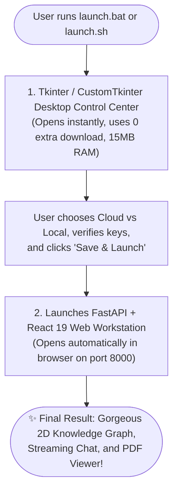

# 13. GUI Framework Evaluation: Choosing the Best Experience

This document analyzes **PySide6 vs Tkinter vs Kivy vs Streamlit vs Gradio** specifically for building the **RAISE Setup Wizard & Mission Control Center**.

---

## 1. Quick Verdict & Recommendation Matrix

| Framework | Best Used For | Install Size | Startup Speed | Visual Quality | Professor / Evaluator Experience |
| :--- | :--- | :--- | :--- | :--- | :--- |
| 🥇 **Tkinter (or CustomTkinter)** | **Setup Wizards & Desktop Control Centers** | **0 MB** (Built-in) / **5 MB** | **Instant (< 0.1s)** | Modern Dark / OLED | ⭐⭐⭐⭐⭐ **(Best Overall)** |
| 🥈 **PySide6 (Qt)** | Heavy Desktop Software (CAD, DAW) | **~220 MB** (Heavy) | Fast (~0.5s) | Gorgeous Native | ⭐⭐⭐ (Too big to download on first run) |
| ❌ **Kivy** | Mobile & Touchscreen Apps | ~90 MB | Moderate | Non-native | ⭐ (Clunky desktop UX, SDL2 errors) |
| ❌ **Streamlit** | Data Science Dashboards | ~60 MB | Slow (~2.5s) | Clean Web UI | ⭐⭐ (Requires a 2nd web server port) |
| ❌ **Gradio** | AI Model Demo Playgrounds | ~80 MB | Slow (~3.0s) | Clean Web UI | ⭐⭐ (Unsuited for system launchers) |

---

## 2. In-Depth Breakdown of Each Option

### 🥇 1. Tkinter / CustomTkinter — The Definite Winner
* **Why it wins for this project**:
  1. **Zero Extra Downloads (Instant Setup)**: `tkinter` is already **built into Python's standard library** on Windows and macOS. It launches immediately without running `pip install`!
  2. **Ultra-Lightweight**: Uses only **~15 MB of RAM** and opens in **0.05 seconds**.
  3. **Already Built**: Your backend repository **already has an 810-line Control Center** in [`src/gui/control_panel.py`](file:///Users/sid/Documents/project/Frontend/scratch/working_raise/src/gui/control_panel.py) written in `tkinter` with an OLED pitch-black theme.
  4. **Want rounded, ultra-modern Windows 11 / macOS widgets?** Simply add [`customtkinter`](https://github.com/TomSchimansky/CustomTkinter) (only **5 MB** download). It transforms Tkinter into a modern dark-mode desktop interface with smooth sliders, rounded tabs, and toggle switches.

---

### 🥈 2. PySide6 (Qt for Python) — Powerful but Too Heavy for First-Run
* **The Good**: Qt is the gold standard for desktop beauty. Apps like VLC, Autodesk Maya, and DaVinci Resolve use Qt.
* **The Dealbreaker**:
  * PySide6 is a **massive 220 MB download** from PyPI.
  * When a professor or first-time user runs `launch.bat`, having them wait 3 minutes on a slow connection just to download Qt build tools for a setup wizard ruins the "2-minute evaluation" promise.
  * Occasional C++ dynamic library errors on older Windows machines or macOS without Xcode tools.

---

### ❌ 3. Kivy — Wrong Tool for the Job
* **Why to avoid**:
  * Kivy was designed for **smartphones and touchscreens** (iOS, Android, Raspberry Pi).
  * On desktop laptops, its widgets feel unnatural (buttons don't look native, scrolling feels like a phone swipe).
  * Requires heavy C-level dependencies (`Cython`, `SDL2`) that frequently fail to compile on Windows.

---

### ❌ 4. Streamlit — Unnecessary Web Server Overhead
* **Why to avoid**:
  * Streamlit is a **web server** (usually runs on port `8501`).
  * Running a Streamlit web server *just to launch another FastAPI web server* on port `8000` creates massive port confusion and double RAM usage.
  * **You ALREADY have a high-end React 19 Frontend UI!** You don't need Streamlit to show a web interface when your React 19 frontend is already 10x more powerful (with 2D force-directed knowledge graphs and streaming chat).

---

### ❌ 5. Gradio — Meant for AI Playgrounds, Not Setup Wizards
* **Why to avoid**:
  * Gradio is designed for quick HuggingFace Spaces (Prompt in $\rightarrow$ Answer out).
  * It does not provide hardware management, database health probes, or background process supervisors.
  * Like Streamlit, it requires running a separate background web server.

---

## 3. The Recommended Architecture

To give your professor and users the **smoothest, most professional experience**:

### Summary Recommendation:
* **For the Setup Wizard & Control Center**: Use **`Tkinter`** (built-in, already implemented in `src/gui/control_panel.py`) or upgrade it with **`customtkinter`** (5 MB).
* **For the Main User Experience**: Use your **React 19 Frontend** (already in `dist/`).
* **Do NOT use Streamlit, Gradio, or Kivy.** They add unnecessary complexity, heavy downloads, and duplicate web servers.
