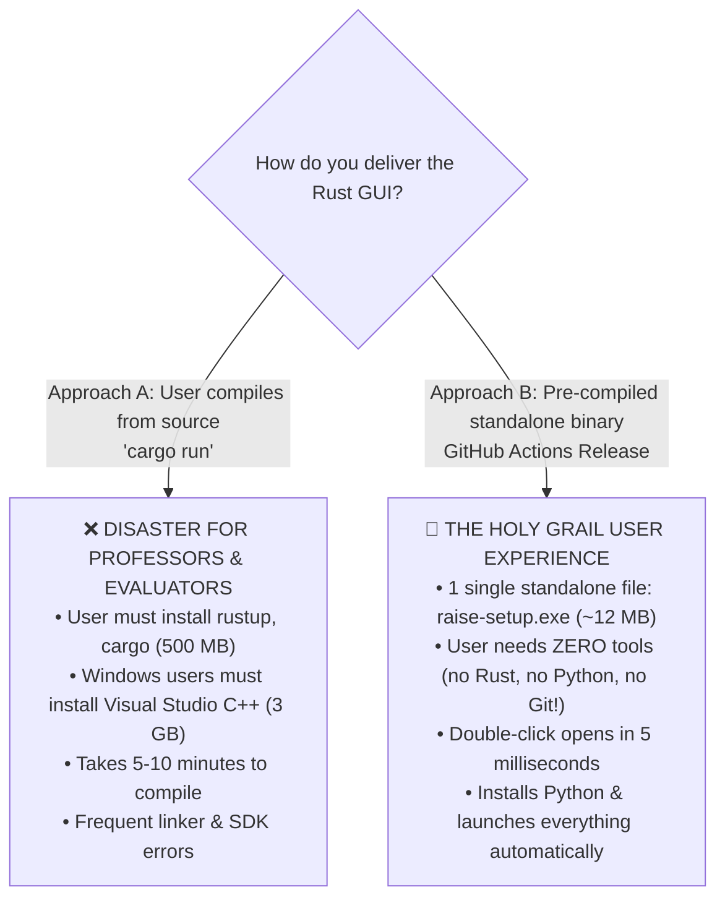

# 14. Rust Desktop GUI Evaluation: Tauri vs Slint vs Python Tkinter

This document evaluates using **Rust** to build the RAISE Mission Control & Universal Bootstrapper, comparing the developer workflow and end-user distribution against Python.

---

## 1. The Verdict on Rust: Two Completely Different Realities

Using Rust for a desktop GUI can either be the **greatest experience** or the **worst disaster**, depending strictly on **HOW** it is distributed:

---

## 2. Approach A vs Approach B Breakdown

### ❌ Approach A: "Compile on User Machine" (`cargo run`)
* **Why it fails**:
  * You cannot ask a professor or reviewer to install the Rust compiler (`rustup`), Visual Studio C++ build tools (2–4 GB), and run `cargo build`.
  * If they don't have C++ headers installed on Windows, it will throw:
    `error: linker 'link.exe' not found`.
  * **Result**: Frustrating experience for non-technical users.

### 🌟 Approach B: "Pre-Compiled Standalone Executable" (The Professional Way)
* **How it works**:
  * You write the GUI in Rust **once**.
  * GitHub Actions automatically compiles it into **3 single-file native executables**:
    * `RAISE-ControlCenter-Windows.exe` (Windows 10/11)
    * `RAISE-ControlCenter-Mac-AppleSilicon.dmg` (M1/M2/M3/M4 Macs)
    * `RAISE-ControlCenter-Linux.AppImage` (Ubuntu/Debian)
* **What your professor experiences**:
  * She downloads **ONE single 12 MB file**.
  * She double-clicks it $\rightarrow$ A gorgeous native window pops up in **5 milliseconds**!
  * The Rust binary checks if Python is on her laptop $\rightarrow$ If not, the Rust app silently downloads Python and launches the server for her.
  * **She doesn't even need to know what terminal or command prompt is!**

---

## 3. Best Rust GUI Frameworks for This Purpose

If you choose the pre-compiled Rust path, here are the top 3 frameworks:

| Framework | How it Works | Binary Size | Visual Quality | Best For |
| :--- | :--- | :--- | :--- | :--- |
| 🥇 **[Tauri 2.0](https://tauri.app)** | Rust backend + React/Tailwind UI (uses native OS Webview) | **~8 MB – 12 MB** | ⭐⭐⭐⭐⭐ Modern Web/Desktop | **#1 Pick** (You can reuse your existing React 19 UI!) |
| 🥈 **[Slint](https://slint.dev)** | Lightweight native Rust GUI markup language | **~9 MB** | ⭐⭐⭐⭐ Clean Native | Great for pure native widgets without webview |
| 🥉 **[egui](https://github.com/emilk/egui)** | Pure immediate-mode Rust (GPU accelerated via wgpu) | **~15 MB** | ⭐⭐⭐ Hacker / Game Engine Look | Super fast, but non-standard UI styling |

---

## 4. Why Tauri 2.0 Is the Secret Superpower for RAISE

If you go with Rust, **Tauri 2.0 is the undisputed winner**.

### The Reason:
* You **ALREADY HAVE** a complete React 19 Frontend in this workspace!
* With Tauri, your existing React 19 frontend can be packaged directly into a native desktop `.exe` or Mac `.app`!
* The Rust backend in Tauri handles:
  * Checking if Python is installed.
  * Downloading Python / Ollama models in background threads.
  * Starting FastAPI in a child process.
  * Writing `.env` configurations natively.

---

## 5. Direct Comparison: Pre-Compiled Rust vs Python Tkinter

| Dimension | Pre-Compiled Rust (Tauri / Slint) | Python (Tkinter / CustomTkinter) |
| :--- | :--- | :--- |
| **Startup Speed** | **Instant (5 ms)** | **Very Fast (80 ms)** |
| **User Needs Python?**| **No** (The Rust binary can install it for them) | **Yes** (or needs `launch.bat` wrapper to install Python) |
| **File Delivered** | Single standalone `.exe` or `.dmg` (12 MB) | Project zip folder with scripts |
| **Development Effort**| Higher (Requires Rust code + GitHub Actions CI build) | **Zero (Already written in `src/gui/control_panel.py`)** |
| **Maintenance** | Need Rust knowledge to edit | Any Python backend dev can edit immediately |

---

## 6. Strategic Recommendation: The Two-Phase Plan

1. **Phase 1 (Immediate / For your Professor & Backend Dev)**:
   * Keep the **Tkinter / CustomTkinter** Control Center in [`src/gui/control_panel.py`](file:///Users/sid/Documents/project/Frontend/scratch/working_raise/src/gui/control_panel.py).
   * **Why**: It is already written in Python, works right now, requires zero compile steps, and your backend developer can modify it immediately.
   * Combined with `launch.bat` and `launch.sh`, it already gives an automated, 1-click experience.

2. **Phase 2 (Long-Term / Commercial Release)**:
   * Wrap the project with **Tauri 2.0** to package the entire RAISE system (React 19 Frontend + Python engine) into a single, downloadable desktop application.
