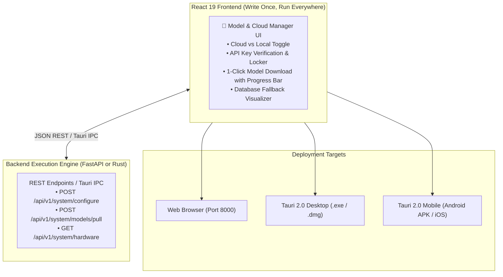

# 17. Frontend Model & Cloud Manager Specification (React 19 + Rust/FastAPI)

This document specifies the architecture for building the **AI Model & Cloud Substrate Manager directly inside the React 19 Frontend**, allowing users to visually choose, configure, and download models on any device (Web, Desktop, Mobile), while communicating with the backend (FastAPI / Rust).

---

## 1. Why Building This in the Frontend Is the Best Decision 🎯



### The 4 Huge Advantages:
1. **Single Unified Codebase**: You only build the UI **once** in React 19 with Tailwind CSS and Lucide icons. It automatically works in web browsers, desktop apps, and mobile phones.
2. **Superior User Experience**: Modern rounded cards, smooth progress bars, live latency badges, and instant validation—far superior to basic desktop Tkinter.
3. **Decoupled Architecture**: The frontend does not care whether the backend is written in Python (FastAPI) or Rust (Tauri). It just sends and receives clean JSON payloads.
4. **Zero Extra Windows**: The user configures their keys and models directly inside the research workstation settings without needing a separate popup launcher.

---

## 2. Frontend Component Architecture: `SettingsModelEngineTab.tsx`

We can add a new tab inside [`src/components/settings/`](file:///Users/sid/Documents/project/Frontend/src/components/settings/) named **`SettingsModelEngineTab.tsx`**:

```text
┌─────────────────────────────────────────────────────────────────────────────┐
│ ⚙️ RAISE Settings > AI Engine & Substrates                                  │
├─────────────────────────────────────────────────────────────────────────────┤
│                                                                             │
│ Select Intelligence Provider:                                               │
│ [ ⚡ Cloud Intelligence (Groq / Gemini) ]   [ 💻 Sovereign Local (Ollama) ] │
│                                                                             │
├─────────────────────────────────────────────────────────────────────────────┤
│ (When Cloud Selected)                                                       │
│                                                                             │
│ Cloud Provider: [ Groq LPU (Sub-second @ 500 tok/sec) ▼ ]                  │
│ API Key:        [ gsk_•••••••••••••••••••••••••••• ] [ Test Key 🔑 ]        │
│ Status:         🟢 Active (Latency: 142ms)                                 │
│                                                                             │
│ Knowledge Graph: (•) Cloud Neo4j AuraDB    ( ) In-Memory Fallback           │
│ URI:             [ neo4j+s://xxxx.databases.neo4j.io ]                      │
│ Password:        [ •••••••••••••••• ] [ Test Connection ⚡ ]                │
├─────────────────────────────────────────────────────────────────────────────┤
│ (When Local Selected)                                                       │
│                                                                             │
│ Select Local Model:                                                         │
│ ┌─────────────────────────────────────────────────────────────────────────┐ │
│ │ [•] Llama 3.2 3B ─── Size: 2.0 GB │ RAM: 4GB–8GB (Best for Mac Air)     │ │
│ │     Status: Downloaded ✅                                               │ │
│ ├─────────────────────────────────────────────────────────────────────────┤ │
│ │ [ ] Qwen 2.5 7B  ─── Size: 4.7 GB │ RAM: 16GB+                          │ │
│ │     [ 📥 Download Model ]                                               │ │
│ │     Progress: [████████████░░░░░░░░░░░░] 48% (12 MB/s)                  │ │
│ └─────────────────────────────────────────────────────────────────────────┘ │
│                                                                             │
│ [ 💾 Save Configuration & Apply ]                                           │
└─────────────────────────────────────────────────────────────────────────────┘
```

---

## 3. Clean API Contracts (Frontend $\leftrightarrow$ Backend)

Tell your backend developer to implement these 3 clean REST endpoints (in FastAPI now, or Rust later):

### Endpoint 1: Save System Configuration
* **Route**: `POST /api/v1/system/configure`
* **Request Body**:
  ```json
  {
    "llm_backend": "groq",
    "groq_api_key": "gsk_xxxxxx",
    "neo4j_mode": "cloud",
    "neo4j_uri": "neo4j+s://xxxx.databases.neo4j.io",
    "neo4j_password": "password123",
    "postgres_mode": "fallback",
    "redis_mode": "fallback"
  }
  ```
* **Response**:
  ```json
  {
    "status": "success",
    "message": "Configuration saved to .env and applied to live runtime"
  }
  ```

---

### Endpoint 2: Local Model Download with Live Progress
* **Route**: `POST /api/v1/system/models/pull`
* **Request Body**:
  ```json
  {
    "model_name": "llama3.2:3b"
  }
  ```
* **Response Stream (Server-Sent Events / SSE)**:
  ```text
  data: {"status": "downloading", "completed_bytes": 104857600, "total_bytes": 2147483648, "percent": 4.8}
  data: {"status": "downloading", "completed_bytes": 1073741824, "total_bytes": 2147483648, "percent": 50.0}
  data: {"status": "completed", "percent": 100.0}
  ```
  *(The React frontend listens to this SSE stream to smoothly update the progress bar from 0% to 100%)*.

---

### Endpoint 3: Test API Connection / Verification Ping
* **Route**: `POST /api/v1/system/test-connection`
* **Request Body**:
  ```json
  {
    "provider": "groq",
    "api_key": "gsk_xxxxxx"
  }
  ```
* **Response**:
  ```json
  {
    "valid": true,
    "latency_ms": 118,
    "available_models": ["llama-3.3-70b-versatile", "mixtral-8x7b-32768"]
  }
  ```

---

## 4. How the Backend Developer Implements It with Rust or Python

### Option A: In Python (FastAPI — Ready for Today)
In [`src/main.py`](file:///Users/sid/Documents/project/Frontend/scratch/working_raise/src/main.py), the developer can handle the download by calling Ollama's native API:
```python
import httpx
from fastapi.responses import StreamingResponse

@app.post("/api/v1/system/models/pull")
async def pull_ollama_model(req: ModelPullRequest):
    async def stream_progress():
        async with httpx.AsyncClient(timeout=None) as client:
            async with client.stream("POST", "http://localhost:11434/api/pull", json={"name": req.model_name}) as resp:
                async for chunk in resp.aiter_lines():
                    if chunk:
                        yield f"data: {chunk}\n\n"
    return StreamingResponse(stream_progress(), media_type="text/event-stream")
```

### Option B: In Rust (Tauri IPC — For Desktop & Mobile APK)
In Tauri's Rust backend (`src-tauri/src/main.rs`), the developer implements native async commands:
```rust
#[tauri::command]
async fn pull_model<R: tauri::Runtime>(app: tauri::AppHandle<R>, model: String) -> Result<(), String> {
    // Calls Ollama or downloads GGUF directly using reqwest at native speed
    Ok(())
}
```

---

## 5. Summary: Why This Approach Is 10/10

1. **You build the UI once** inside this frontend workspace using React 19 & Tailwind.
2. **The user gets an intuitive, visual experience** to toggle Cloud vs Local, download models, test keys, and see progress bars.
3. **The backend developer has clear, simple API contracts** (`/api/v1/system/...`) that they can wire up in Python today and optimize with Rust later.
4. **The same UI works seamlessly on Web, Desktop (.exe/.dmg), and Mobile APK!**
