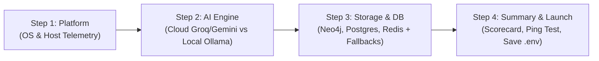

# 20. Installer Wizard & Dynamic Footprint Specification

This document specifies the **Workstation Mission Control Installer Wizard**, detailing its interface semantics, rigid centered layout, real-time dynamic footprint engine, and backend/Rust IPC contract.

---

## 1. Design Philosophy: Native Installer Experience 🚀

Desktop and web workstations should feel deterministic, robust, and elegant. The Setup Wizard eliminates cognitive overload by adopting standard installer semantics:
1. **Crisp Action Buttons**: Standard `← Previous` and `Next →` navigation. No verbose filler phrases or confusing jargon.
2. **Fixed Rigid Window (Zero Bouncing)**: Centered `860px × 680px` uniform container. Outer frame dimensions never flex, resize, or shift between steps.
3. **Transparent Download Sizes**: Every card and substrate option explicitly displays its on-disk footprint (`0 GB` for Cloud vs `2.0 GB` / `4.7 GB` for local weights).
4. **Dynamic Running Footprint Tracker**: Real-time aggregation of active substrates, computing cumulative download size and estimated RAM usage without hardcoded static sums.



---

## 2. Step-by-Step Architecture

### Step 1: Target Platform & Hardware Telemetry
* **Purpose**: Identifies deployment target (macOS, Windows, Linux, Android, iOS) and queries host system diagnostics.
* **Telemetry Data Points**:
  * Platform OS: Detected from host (`navigator` or Rust `std::env::consts::OS`).
  * Physical RAM: Total RAM in GB.
  * CPU Cores: Logical execution threads.
* **Uniform Card Height**: `h-[124px]` grid cards with check indicators.

### Step 2: Intelligence Engine
* **Option A: 100% Free Cloud AI (Recommended)**:
  * **Download Size**: `0 GB (Zero Download)`
  * **Memory**: `~1.2 GB RAM`
  * **Speed**: Sub-second (~0.8s) via Groq LPU (Llama 3.3 70B) or Gemini 2.5 Flash.
* **Option B: Sovereign Local AI (Ollama)**:
  * **Download Size**: `2.0 GB` (Llama 3.2 3B) or `4.7 GB` (Qwen 2.5 7B).
  * **Memory**: `~3.8 GB` - `~8.0 GB RAM`.
  * **Interactive Model Pull**: Real-time progress bar with bytes transferred and speed.

### Step 3: Storage, Graph & Databases
* **Neo4j Graph Layer**:
  * Free Cloud Neo4j AuraDB: `0 GB Download`
  * Local Neo4j Bolt Container: `1.5 GB Download`
  * Vector Search Fallback: `0 GB Download` (Zero-crash guarantee using ChromaDB + BM25)
* **PostgreSQL (Session Store)**:
  * In-Memory Shield: `0 GB Download` • Zero install
  * Cloud Neon Postgres: Serverless cloud relational database
* **Redis (Caching & Abort Signals)**:
  * In-Memory Cache: `0 GB Download` • Instant sub-second response
  * Cloud Upstash Redis: Serverless TLS cache

### Step 4: Summary & Installation Pre-Flight
* **Scorecard**: Displays active target platform, AI backend, graph database, relational store, and caching mode.
* **Dynamic Diagnostic Ping**: Tests live endpoints (`/api/health`, Neo4j Bolt, Redis ping) and displays status badges.
* **Primary Launch Action**: Solid white button (`Install & Launch Workstation`) applying configuration to `.env` and initializing the research interface.

---

## 3. Dynamic Footprint Calculator Algorithm

Implemented in `src/features/control-center/services/resourceCalculator.ts`:

```typescript
export function calculateResourceFootprint(config: ControlCenterConfig): ResourceFootprint {
  let totalDiskGb = 0.0;
  let totalRamGb = 1.2; // Base workstation client runtime

  // 1. LLM Engine Footprint
  if (!config.llmMode.startsWith('cloud')) {
    if (config.selectedLocalModel.includes('7b')) {
      totalDiskGb += 4.7;
      totalRamGb += 6.0;
    } else {
      totalDiskGb += 2.0;
      totalRamGb += 2.6;
    }
  }

  // 2. Neo4j Graph Footprint
  if (config.neo4jMode === 'local') {
    totalDiskGb += 1.5;
    totalRamGb += 0.5;
  }

  return {
    totalDiskGb: parseFloat(totalDiskGb.toFixed(1)),
    totalRamGb: parseFloat(totalRamGb.toFixed(1)),
    addedSubstrates: [ ... ],
  };
}
```

---

## 4. UI Metric Specifications

| UI Element | Height / Dimensions | Styling Details |
| :--- | :--- | :--- |
| **Modal Container** | `w-[860px] h-[680px]` | Centered, `border border-white/10 shadow-2xl rounded-2xl bg-[#0e1017]` |
| **Top Header Bar** | `h-16 px-6` | Monospace uppercase title, workstation badge, close button |
| **Stepper Tab Bar** | `h-12 px-6` | Active tab solid white pill, passed tabs muted white |
| **Step Content Body**| `flex-1 min-h-0 (456px)` | `overflow-y-auto p-6 space-y-6 bg-[#0e1017]` |
| **Footprint Bar** | `h-12 px-6` | Dynamic download badge + active substrate pills |
| **Footer Navigation** | `h-16 px-6` | Step indicator left, `Previous` / `Next` right |
